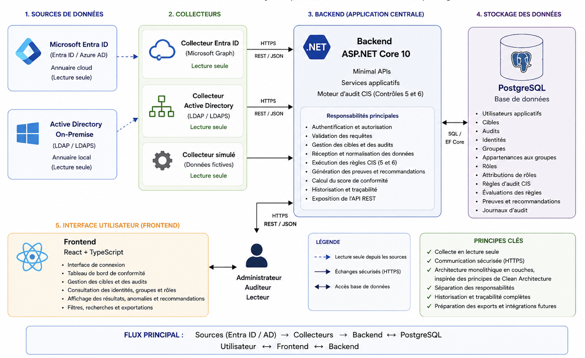

# Identity Audit

Plateforme d’audit des identités et des privilèges alignée sur les **CIS Controls 5 et 6**.

Identity Audit centralise les données provenant de **Microsoft Entra ID** et d’**Active Directory On-Premise**, puis analyse les comptes, groupes, rôles et privilèges afin de détecter les situations non conformes.

## Fonctionnalités

L’application permet de :

- gérer plusieurs cibles Microsoft Entra ID et Active Directory ;
- créer et suivre des sessions d’audit ;
- collecter les identités, groupes, rôles et appartenances ;
- identifier les comptes actifs, désactivés, privilégiés et de service ;
- appliquer des règles d’évaluation liées aux CIS Controls 5 et 6 ;
- calculer un score de conformité ;
- afficher les constats, preuves et recommandations ;
- consulter l’historique des audits ;
- visualiser les données dans une interface React.

## Architecture générale



```text
Microsoft Entra ID                  Active Directory
        │                                   │
        ▼                                   ▼
Collecteur Entra ID                 Collecteur AD
        └──────────────┬────────────────────┘
                       ▼
                API ASP.NET Core
                       │
                       ▼
                  PostgreSQL
                       ▲
                       │
                 Frontend React
```

L’application utilise une architecture en couches :

- `IdentityAudit.Domain` : entités et énumérations métier ;
- `IdentityAudit.Application` : contrats, DTO et interfaces ;
- `IdentityAudit.Infrastructure` : persistance et services ;
- `IdentityAudit.Api` : endpoints HTTP ;
- `collectors` : collecte et normalisation des données ;
- `frontend` : interface utilisateur React.

## Stack technique

| Composant                       | Technologies             |
| ------------------------------- | ------------------------ |
| Backend                         | ASP.NET Core 10, C#      |
| Accès aux données               | Entity Framework Core 10 |
| Base de données                 | PostgreSQL               |
| Frontend                        | React 19, TypeScript 6   |
| Outil de développement frontend | Vite 8                   |
| Communication                   | API REST, JSON           |
| Interface                       | CSS, Lucide React        |
| Versionnement                   | Git                      |

## Structure du projet

```text
identity-audit/
├── backend/
│   ├── IdentityAudit.Api/
│   ├── IdentityAudit.Application/
│   ├── IdentityAudit.Domain/
│   ├── IdentityAudit.Infrastructure/
│   └── IdentityAudit.sln
├── collectors/
│   ├── active-directory/
│   ├── entra-id/
│   └── mock-collector/
├── frontend/
│   ├── src/
│   ├── package.json
│   └── README.md
├── database/
├── deployment/
├── docs/
│   ├── diagrams/
│   ├── 01-modele-donnees.md
│   ├── 02-catalogue-regles.md
│   ├── 03-schema-base-donnees.md
│   └── 04-architecture-technique.md
├── tests/
└── README.md
```

## Modèle fonctionnel

Chaque collecte est associée à un audit précis :

```text
Cible
  └── Audit
       ├── Identités
       ├── Groupes
       │    └── Appartenances
       ├── Rôles
       │    └── Affectations
       └── Évaluations des règles CIS
```

Cette organisation permet de conserver plusieurs photographies d’une même cible et de préserver l’historique des collectes.

## Cycle d’un audit

Un audit suit les étapes suivantes :

1. création d’une cible ;
2. création d’un audit au statut `Pending` ;
3. démarrage de l’audit au statut `Running` ;
4. exécution du collecteur correspondant ;
5. import des identités, groupes, rôles et relations ;
6. finalisation de l’audit ;
7. évaluation des règles CIS ;
8. calcul du score et affichage des résultats.

## Prérequis

Pour exécuter le projet localement :

- .NET SDK 10 ;
- PostgreSQL 14 ou supérieur ;
- Node.js 24 recommandé ;
- npm 11 ou supérieur ;
- Git.

Le collecteur Active Directory réel nécessite également :

- un environnement Windows ;
- un domaine Active Directory accessible ;
- une connexion LDAP ou LDAPS correctement configurée.

## Installation de la base de données

Créer la base PostgreSQL si elle n’existe pas encore :

```bash
createdb identity_audit
```

Configurer ensuite la chaîne de connexion PostgreSQL utilisée par l’API dans la configuration de développement locale.

Ne pas enregistrer de mot de passe réel dans Git.

Appliquer les migrations Entity Framework depuis la racine du projet :

```bash
ASPNETCORE_ENVIRONMENT=Development \
dotnet tool run dotnet-ef database update \
--project backend/IdentityAudit.Infrastructure \
--startup-project backend/IdentityAudit.Api
```

## Lancement du backend

Depuis la racine du projet :

```bash
dotnet run --project backend/IdentityAudit.Api
```

L’API est disponible à l’adresse :

```text
http://localhost:5173
```

Vérification de son état :

```bash
curl http://localhost:5173/api/health
```

## Lancement du frontend

Depuis le dossier `frontend` :

```bash
cp .env.example .env
npm install
npm run dev
```

L’interface est disponible à l’adresse :

```text
http://localhost:5174
```

La variable utilisée par le frontend est :

```env
VITE_API_BASE_URL=http://localhost:5173
```

## Collecteurs

### Collecteur Microsoft Entra ID

```bash
dotnet run \
--project collectors/entra-id/IdentityAudit.EntraCollector.csproj
```

Le mode actuellement utilisé pour la démonstration repose sur des données Microsoft Graph simulées et normalisées avant leur envoi à l’API.

### Collecteur Active Directory

```bash
dotnet run \
--project collectors/active-directory/IdentityAudit.ActiveDirectoryCollector.csproj
```

Ce collecteur est destiné à être exécuté depuis l’environnement Windows disposant de l’accès au domaine Active Directory.

### Collecteur de démonstration

```bash
dotnet run \
--project collectors/mock-collector/IdentityAudit.MockCollector.csproj
```

Il permet de valider le cycle d’import sans dépendre d’un annuaire externe.

## Endpoints principaux

| Méthode | Endpoint                            | Fonction                  |
| ------- | ----------------------------------- | ------------------------- |
| `GET`   | `/api/health`                       | Vérifier l’état de l’API  |
| `GET`   | `/api/targets`                      | Lister les cibles         |
| `POST`  | `/api/targets`                      | Créer une cible           |
| `PUT`   | `/api/targets/{id}`                 | Modifier une cible        |
| `POST`  | `/api/targets/{id}/test-connection` | Tester la connexion       |
| `GET`   | `/api/audits`                       | Lister les audits         |
| `POST`  | `/api/audits`                       | Créer un audit            |
| `POST`  | `/api/audits/{id}/start`            | Démarrer un audit         |
| `POST`  | `/api/audits/{id}/complete`         | Terminer un audit         |
| `GET`   | `/api/audits/{id}/identities`       | Consulter les identités   |
| `GET`   | `/api/audits/{id}/groups`           | Consulter les groupes     |
| `GET`   | `/api/audits/{id}/roles`            | Consulter les rôles       |
| `GET`   | `/api/audits/{id}/rule-evaluations` | Consulter les évaluations |
| `POST`  | `/api/audits/{id}/evaluate`         | Évaluer les règles CIS    |

## Interface utilisateur

Le frontend contient quatre vues principales :

- **Tableau de bord** : KPI, score CIS, gravité des constats et audits récents ;
- **Cibles** : création, modification et test de connexion ;
- **Audits** : création, filtrage, démarrage et finalisation ;
- **Détail d’un audit** : résultats CIS, identités, groupes et rôles.

Le Dashboard utilise le dernier audit terminé pour ses indicateurs tout en conservant les audits en attente ou en cours dans l’historique.

## Vérification du projet

Compiler l’ensemble du backend et des collecteurs :

```bash
dotnet build backend/IdentityAudit.sln
```

Compiler le frontend :

```bash
cd frontend
npm run build
```

Vérifier le code frontend :

```bash
npm run lint
```

## Documentation

La documentation technique est disponible dans `docs/` :

- modèle des données collectées ;
- catalogue des règles CIS ;
- schéma de la base PostgreSQL ;
- architecture technique ;
- diagramme de classes ;
- schéma relationnel ;
- architecture générale.

## État actuel

Les fonctionnalités principales sont opérationnelles :

- API et base PostgreSQL ;
- collecteurs Entra ID, Active Directory et simulé ;
- gestion des cibles ;
- gestion du cycle des audits ;
- collecte des identités, groupes et rôles ;
- évaluation CIS Controls 5 et 6 ;
- calcul du score de conformité ;
- affichage des preuves et recommandations ;
- interface React complète et responsive.

Le test de connexion depuis la page Cibles est actuellement simulé. Une connexion réelle à Microsoft Graph ou à LDAPS pourra être intégrée comme évolution.
