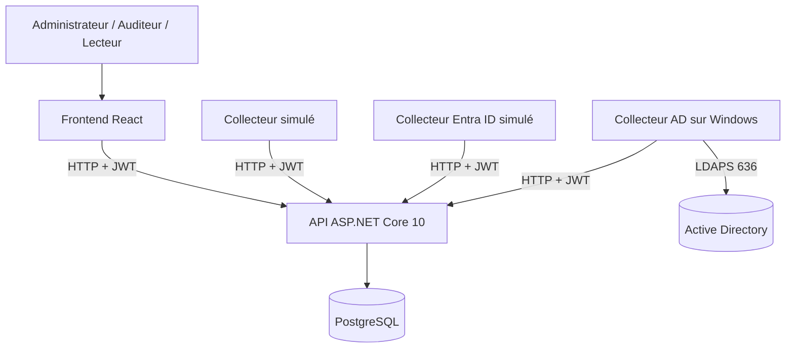

# Identity Audit

Plateforme d’audit des identités et des privilèges alignée sur les **CIS Controls 5 et 6**.

Identity Audit collecte, centralise et analyse les comptes, groupes, rôles et privilèges provenant de Microsoft Entra ID et d’Active Directory On-Premise.

## État du projet

Les principales fonctionnalités sont opérationnelles :

- API ASP.NET Core 10 ;
- base PostgreSQL avec migrations Entity Framework Core ;
- authentification JWT ;
- rôles `Administrator`, `Auditor` et `Reader` ;
- gestion des utilisateurs et des cibles ;
- cycle complet des audits ;
- collecte des identités, groupes, appartenances, rôles et affectations ;
- collecteur Active Directory réel avec LDAPS ;
- collecteur Microsoft Entra ID simulé ;
- règles CIS Controls 5 et 6 ;
- score de conformité ;
- preuves et recommandations ;
- export CSV compatible Excel et rapport PDF détaillé ;
- journal propre à chaque audit ;
- journal d’activité global réservé aux administrateurs ;
- interface React ;
- tests d’intégration de l’API.

## Limite actuelle

Le collecteur Microsoft Entra ID fonctionne avec des réponses Microsoft Graph simulées, car aucun tenant Entra ID réel n’est actuellement disponible.

Le collecteur Active Directory a été testé avec un domaine réel de laboratoire en **LDAPS sur le port `636`**.

## Architecture générale



Dans le laboratoire réel :

```text
Mac
├── API ASP.NET Core : http://<IP-MAC>:5173
├── PostgreSQL
└── Frontend React : http://localhost:5174

Windows
├── Collecteur Active Directory
├── connexion à l’API du Mac avec JWT
└── connexion au contrôleur de domaine avec LDAPS 636
```

L’utilisation de HTTP entre Windows et le Mac est limitée au laboratoire isolé. Un déploiement réel devra utiliser HTTPS.

## Architecture du backend

Le backend est un monolithe organisé en couches :

- `IdentityAudit.Domain` : entités et énumérations métier ;
- `IdentityAudit.Application` : DTO, contrats et interfaces ;
- `IdentityAudit.Infrastructure` : persistance et services ;
- `IdentityAudit.Api` : endpoints Minimal API et sécurité.

Les collecteurs sont séparés du backend :

- `collectors/common` : authentification commune auprès de l’API ;
- `collectors/mock-collector` : données de démonstration ;
- `collectors/entra-id` : collecte Microsoft Graph simulée ;
- `collectors/active-directory` : collecte Active Directory réelle.

## Stack technique

| Composant        | Technologies                     |
| ---------------- | -------------------------------- |
| Backend          | ASP.NET Core 10, C#              |
| API              | Minimal APIs, JSON, JWT          |
| Persistance      | Entity Framework Core 10, Npgsql |
| Base de données  | PostgreSQL                       |
| Frontend         | React 19, TypeScript 6, Vite 8   |
| Génération PDF   | QuestPDF 2026.7.3                |
| Collecteurs      | .NET 10                          |
| Active Directory | LDAPS `636`                      |
| Tests            | xUnit, `WebApplicationFactory`   |
| Versionnement    | Git                              |

## Structure du projet

```text
identity-audit/
├── backend/
│   ├── IdentityAudit.Api/
│   ├── IdentityAudit.Application/
│   ├── IdentityAudit.Domain/
│   ├── IdentityAudit.Infrastructure/
│   └── IdentityAudit.sln
├── collectors/
│   ├── common/
│   ├── active-directory/
│   ├── entra-id/
│   └── mock-collector/
├── frontend/
├── tests/
│   └── IdentityAudit.Api.IntegrationTests/
├── database/
├── deployment/
├── docs/
└── README.md
```

## Modèle fonctionnel

Chaque audit constitue une photographie indépendante :

```text
Cible
└── Audit
    ├── Identités
    ├── Groupes
    │   └── Appartenances
    ├── Rôles
    │   └── Affectations
    ├── Évaluations CIS
    └── Journal
```

Cette organisation conserve l’historique sans écraser les collectes précédentes.

## Cycle d’un audit

Un collecteur réalise les opérations suivantes :

1. authentification auprès de l’API ;
2. création de l’audit au statut `Pending` ;
3. démarrage de l’audit au statut `Running` ;
4. import des identités ;
5. import des groupes et appartenances ;
6. import des rôles et affectations ;
7. finalisation de l’audit au statut `Completed` ;
8. évaluation des règles CIS ;
9. calcul du score de conformité ;
10. journalisation des opérations importantes.

## Sécurité et rôles

L’API utilise un jeton JWT transmis dans l’en-tête :

```http
Authorization: Bearer <JWT>
```

| Rôle            | Droits principaux                                  |
| --------------- | -------------------------------------------------- |
| `Reader`        | Consulter les audits et leurs résultats            |
| `Auditor`       | Consulter et gérer les audits                      |
| `Administrator` | Gérer les cibles, utilisateurs et journaux globaux |

Les collecteurs utilisent le compte technique :

```text
collector@identityaudit.local
```

Ce compte possède uniquement le rôle `Auditor`.

Les mots de passe, certificats privés et JWT ne doivent jamais être enregistrés dans Git.

## Prérequis

### Mac

- .NET SDK 10 ;
- PostgreSQL 14 ou supérieur ;
- Node.js 24 ;
- npm 11 ;
- Git.

### Windows pour le collecteur AD

- Windows x64 ;
- accès réseau au contrôleur de domaine ;
- résolution DNS du contrôleur ;
- accès LDAPS sur le port `636` ;
- certificat de l’autorité de certification du laboratoire ;
- compte Active Directory limité à la lecture ;
- accès réseau à l’API exécutée sur le Mac.

## Base PostgreSQL

Créer la base si nécessaire :

```bash
createdb identity_audit
```

Configurer localement la chaîne de connexion de l’API, puis appliquer les migrations :

```bash
dotnet ef database update \
--project backend/IdentityAudit.Infrastructure \
--startup-project backend/IdentityAudit.Api
```

Ne jamais enregistrer la chaîne de connexion contenant un mot de passe réel dans Git.

## Lancement de l’API

Pour une utilisation uniquement sur le Mac :

```bash
dotnet run \
--project backend/IdentityAudit.Api
```

Pour permettre au collecteur Windows de joindre l’API :

```bash
dotnet run \
--project backend/IdentityAudit.Api \
-- \
--urls http://0.0.0.0:5173
```

Vérification :

```bash
curl -sS \
http://localhost:5173/api/health
```

Résultat attendu :

```json
{
  "status": "Healthy",
  "service": "IdentityAudit.Api"
}
```

## Lancement du frontend

```bash
cp frontend/.env.example frontend/.env
npm --prefix frontend install
npm --prefix frontend run dev
```

Configuration locale :

```env
VITE_API_BASE_URL=http://localhost:5173
```

L’interface est accessible sur :

```text
http://localhost:5174
```

## Authentification des collecteurs

Avant d’exécuter un collecteur sur macOS :

```bash
export \
IDENTITY_AUDIT_API_EMAIL="collector@identityaudit.local"
```

```bash
read -s \
"IDENTITY_AUDIT_API_PASSWORD?Mot de passe du collecteur : "
echo
export IDENTITY_AUDIT_API_PASSWORD
```

Après le test :

```bash
unset \
IDENTITY_AUDIT_API_EMAIL \
IDENTITY_AUDIT_API_PASSWORD
```

## Collecteur de démonstration

```bash
dotnet run \
--project collectors/mock-collector \
-- \
<TARGET_ID> \
http://localhost:5173
```

Il permet de tester le cycle d’un audit sans annuaire externe.

## Collecteur Microsoft Entra ID

```bash
dotnet run \
--project collectors/entra-id/IdentityAudit.EntraCollector.csproj \
-- \
<TARGET_ID> \
http://localhost:5173
```

Ce collecteur utilise actuellement des fichiers JSON simulant la pagination et les réponses Microsoft Graph.

Il collecte et normalise :

- utilisateurs ;
- groupes ;
- appartenances ;
- définitions de rôles ;
- affectations de rôles.

## Collecteur Active Directory

Le collecteur est publié sur le Mac pour Windows x64 :

```bash
dotnet publish \
collectors/active-directory/IdentityAudit.ActiveDirectoryCollector.csproj \
-c Release \
-r win-x64 \
--self-contained true \
-o /tmp/identityaudit-ad-win-x64-latest
```

Configuration requise sur Windows :

```powershell
$env:AD_HOST = "LAB-DC01.identityaudit.test"
$env:AD_PORT = "636"
$env:AD_USE_SSL = "true"
$env:AD_BASE_DN = "DC=identityaudit,DC=test"
$env:AD_BIND_USERNAME = "collecteur@identityaudit.test"
$env:AD_TIMEOUT_SECONDS = "15"
$env:AD_TRUSTED_CA_CERTIFICATE = "C:\IdentityAudit\certs\IdentityAudit-Lab-RootCA.cer"
$env:IDENTITY_AUDIT_API_EMAIL = "collector@identityaudit.local"
```

Les variables sensibles suivantes doivent être demandées de manière interactive :

```text
AD_BIND_PASSWORD
IDENTITY_AUDIT_API_PASSWORD
```

Exécution :

```powershell
.\IdentityAudit.ActiveDirectoryCollector.exe `
"<TARGET_ID>" `
"http://<IP-MAC>:5173"
```

Le mot de passe Active Directory, le mot de passe API et le JWT ne sont jamais journalisés.

## Fonctionnalités du frontend

L’interface contient :

- tableau de bord ;
- gestion des cibles ;
- historique et gestion des audits ;
- détail des résultats CIS ;
- identités ;
- groupes et appartenances ;
- rôles et affectations ;
- exports CSV et PDF ;
- journal propre à chaque audit ;
- gestion des utilisateurs ;
- journal d’activité global administrateur.

Routes principales :

| Route              | Accès                                              |
| ------------------ | -------------------------------------------------- |
| `/login`           | Public                                             |
| `/`                | Utilisateur authentifié                            |
| `/targets`         | Utilisateur authentifié, actions limitées par rôle |
| `/audits`          | Utilisateur authentifié                            |
| `/audits/:auditId` | Utilisateur authentifié                            |
| `/users`           | `Administrator`                                    |
| `/activity-logs`   | `Administrator`                                    |

## Endpoints principaux

| Endpoint                            | Description                      |
| ----------------------------------- | -------------------------------- |
| `POST /api/auth/login`              | Obtenir un JWT                   |
| `GET /api/auth/me`                  | Consulter l’utilisateur connecté |
| `/api/targets`                      | Gestion des cibles               |
| `/api/audits`                       | Gestion des audits               |
| `/api/audits/{id}/identities`       | Identités d’un audit             |
| `/api/audits/{id}/groups`           | Groupes d’un audit               |
| `/api/audits/{id}/roles`            | Rôles d’un audit                 |
| `/api/audits/{id}/rule-evaluations` | Résultats CIS                    |
| `GET /api/audits/{id}/export.csv`   | Export CSV                       |
| `GET /api/audits/{id}/export.pdf`   | Rapport PDF détaillé             |
| `GET /api/audits/{id}/logs`         | Journal d’un audit               |
| `GET /api/audit-logs?limit=200`     | Journal global administrateur    |
| `/api/application-users`            | Gestion des utilisateurs         |
| `GET /api/health`                   | État de l’API                    |

## Exports CSV et PDF

Les résultats CIS peuvent être téléchargés depuis le détail d’un audit dans deux formats.

### Export CSV

L’export CSV :

- nécessite un JWT ;
- utilise UTF-8 avec BOM ;
- utilise le séparateur `;` ;
- contient les règles, statuts, constats, preuves et recommandations ;
- est compatible avec Microsoft Excel.

### Rapport PDF

Le rapport PDF est généré avec QuestPDF. Il contient :

- les informations générales de l’audit ;
- le score et la synthèse de conformité ;
- le tableau des règles CIS évaluées ;
- le détail des non-conformités ;
- la sévérité et le nombre de constats ;
- les recommandations ;
- les preuves collectées sous une forme lisible ;
- un en-tête et une pagination.

Les deux formats sont générés par l’API puis téléchargés depuis l’interface React.

## Journalisation

Deux vues sont disponibles :

```text
Détail d’un audit
└── Journal
    → événements de cet audit

Administration
└── Journal d’activité
    → événements de tous les audits
```

Le journal global est limité aux administrateurs.

Les événements actuellement enregistrés comprennent :

- création d’un audit ;
- démarrage d’un audit ;
- finalisation d’un audit ;
- évaluation des règles ;
- export CSV et PDF.

## Vérification du projet

Compiler le backend et les collecteurs :

```bash
dotnet build backend/IdentityAudit.sln
```

Exécuter les tests d’intégration :

```bash
dotnet test \
tests/IdentityAudit.Api.IntegrationTests/IdentityAudit.Api.IntegrationTests.csproj
```

Résultat validé :

```text
9 tests réussis
0 test échoué
```

Compiler le frontend :

```bash
npm --prefix frontend run build
```

Vérifier les différences Git :

```bash
git diff --check
git status --short
```

## Documentation

Les documents techniques se trouvent dans `docs/` :

- `01-modele-donnees.md` ;
- `02-catalogue-regles.md` ;
- `03-schema-base-donnees.md` ;
- `04-architecture-technique.md`.

## Évolutions possibles

- connexion à un tenant Microsoft Entra ID réel ;
- utilisation de HTTPS entre tous les composants ;
- ajout d’événements administratifs supplémentaires au journal global ;
- pagination serveur du journal d’activité ;
- automatisation du déploiement.
