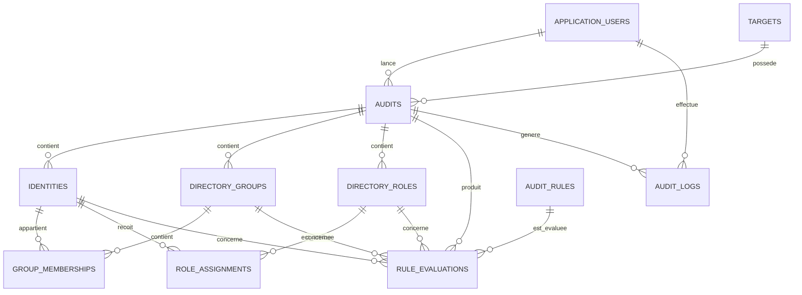

# Schéma logique de la base de données

## 1. Principe général

Chaque audit constitue une photographie des données collectées à un moment précis.

Une cible peut donc avoir plusieurs audits. Chaque audit contient ses propres identités, groupes, rôles, relations et résultats de règles.

Cette organisation permet de :

- conserver l’historique des audits ;
- comparer plusieurs audits ;
- éviter d’écraser les anciennes données ;
- calculer le score de conformité pour chaque audit.

## 2. Diagramme des relations



## 3. Tables principales

### 3.1 ApplicationUsers

Contient les utilisateurs autorisés à accéder à l’application.

| Colonne      | Type         | Description                         |
| ------------ | ------------ | ----------------------------------- |
| Id           | UUID         | Clé primaire                        |
| Email        | VARCHAR(255) | Adresse de connexion unique         |
| PasswordHash | TEXT         | Empreinte sécurisée du mot de passe |
| DisplayName  | VARCHAR(255) | Nom d’affichage                     |
| Role         | VARCHAR(30)  | Administrator, Auditor ou Reader    |
| IsActive     | BOOLEAN      | État du compte                      |
| CreatedAt    | TIMESTAMPTZ  | Date de création                    |
| UpdatedAt    | TIMESTAMPTZ  | Date de modification                |

### 3.2 Targets

Contient les environnements à auditer.

| Colonne           | Type                 | Description                 |
| ----------------- | -------------------- | --------------------------- |
| Id                | UUID                 | Clé primaire                |
| Name              | VARCHAR(255)         | Nom de la cible             |
| Type              | VARCHAR(30)          | EntraID ou ActiveDirectory  |
| IsEnabled         | BOOLEAN              | Cible activée ou désactivée |
| ConfigurationJson | JSONB                | Configuration non sensible  |
| CreatedAt         | TIMESTAMPTZ          | Date de création            |
| UpdatedAt         | TIMESTAMPTZ          | Date de modification        |
| LastCollectedAt   | TIMESTAMPTZ nullable | Date de dernière collecte   |

Les mots de passe, secrets, clés et jetons ne doivent pas être stockés directement dans `ConfigurationJson`.

### 3.3 Audits

Contient les audits lancés sur les cibles.

| Colonne         | Type                  | Description                                                  |
| --------------- | --------------------- | ------------------------------------------------------------ |
| Id              | UUID                  | Clé primaire                                                 |
| TargetId        | UUID                  | Clé étrangère vers Targets                                   |
| CreatedByUserId | UUID nullable         | Utilisateur ayant lancé l’audit                              |
| Status          | VARCHAR(40)           | Pending, Running, Completed, CompletedWithWarnings ou Failed |
| StartedAt       | TIMESTAMPTZ nullable  | Début de l’audit                                             |
| CompletedAt     | TIMESTAMPTZ nullable  | Fin de l’audit                                               |
| ComplianceScore | NUMERIC(5,2) nullable | Score entre 0 et 100                                         |
| ErrorMessage    | TEXT nullable         | Message d’erreur                                             |
| CreatedAt       | TIMESTAMPTZ           | Date de création                                             |

### 3.4 Identities

Contient les comptes collectés pendant un audit.

| Colonne          | Type                  | Description                                  |
| ---------------- | --------------------- | -------------------------------------------- |
| Id               | UUID                  | Clé primaire                                 |
| AuditId          | UUID                  | Audit associé                                |
| ExternalId       | VARCHAR(255)          | Identifiant dans l’annuaire                  |
| DisplayName      | VARCHAR(255)          | Nom d’affichage                              |
| UserName         | VARCHAR(255)          | Nom de connexion                             |
| Email            | VARCHAR(255) nullable | Adresse électronique                         |
| Source           | VARCHAR(30)           | EntraID ou ActiveDirectory                   |
| AccountType      | VARCHAR(40)           | User, Guest, Administrator ou ServiceAccount |
| IsEnabled        | BOOLEAN               | Compte actif ou désactivé                    |
| IsPrivileged     | BOOLEAN               | Compte privilégié ou non                     |
| IsServiceAccount | BOOLEAN               | Compte de service ou non                     |
| IsLocked         | BOOLEAN nullable      | Compte verrouillé ou non                     |
| LastSignInAt     | TIMESTAMPTZ nullable  | Dernière connexion                           |
| Description      | TEXT nullable         | Description du compte                        |
| Owner            | VARCHAR(255) nullable | Responsable du compte                        |
| MfaStatus        | VARCHAR(30) nullable  | Enabled, Disabled, Unknown ou NotAvailable   |
| CollectedAt      | TIMESTAMPTZ           | Date de collecte                             |

Une contrainte d’unicité sera créée sur :

```text
AuditId + ExternalId
```

### 3.5 DirectoryGroups

Contient les groupes collectés.

| Colonne      | Type                 | Description                |
| ------------ | -------------------- | -------------------------- |
| Id           | UUID                 | Clé primaire               |
| AuditId      | UUID                 | Audit associé              |
| ExternalId   | VARCHAR(255)         | Identifiant externe        |
| Name         | VARCHAR(255)         | Nom du groupe              |
| Description  | TEXT nullable        | Description                |
| Source       | VARCHAR(30)          | EntraID ou ActiveDirectory |
| GroupType    | VARCHAR(50) nullable | Type du groupe             |
| IsPrivileged | BOOLEAN              | Groupe sensible ou non     |
| CollectedAt  | TIMESTAMPTZ          | Date de collecte           |

### 3.6 GroupMemberships

Représente les appartenances des identités aux groupes.

| Colonne        | Type        | Description        |
| -------------- | ----------- | ------------------ |
| Id             | UUID        | Clé primaire       |
| IdentityId     | UUID        | Identité membre    |
| GroupId        | UUID        | Groupe concerné    |
| MembershipType | VARCHAR(20) | Direct ou Indirect |
| CollectedAt    | TIMESTAMPTZ | Date de collecte   |

Une contrainte d’unicité sera créée sur :

```text
IdentityId + GroupId
```

### 3.7 DirectoryRoles

Contient les rôles collectés.

| Colonne      | Type          | Description                |
| ------------ | ------------- | -------------------------- |
| Id           | UUID          | Clé primaire               |
| AuditId      | UUID          | Audit associé              |
| ExternalId   | VARCHAR(255)  | Identifiant externe        |
| Name         | VARCHAR(255)  | Nom du rôle                |
| Description  | TEXT nullable | Description                |
| Source       | VARCHAR(30)   | EntraID ou ActiveDirectory |
| IsPrivileged | BOOLEAN       | Rôle sensible ou non       |
| CollectedAt  | TIMESTAMPTZ   | Date de collecte           |

### 3.8 RoleAssignments

Représente les rôles attribués aux identités.

| Colonne         | Type                 | Description                          |
| --------------- | -------------------- | ------------------------------------ |
| Id              | UUID                 | Clé primaire                         |
| IdentityId      | UUID                 | Identité concernée                   |
| DirectoryRoleId | UUID                 | Rôle attribué                        |
| AssignedAt      | TIMESTAMPTZ nullable | Date d’attribution                   |
| ExpiresAt       | TIMESTAMPTZ nullable | Date d’expiration                    |
| IsPermanent     | BOOLEAN              | Attribution permanente ou temporaire |
| CollectedAt     | TIMESTAMPTZ          | Date de collecte                     |

### 3.9 AuditRules

Contient le catalogue des règles d’audit.

| Colonne        | Type         | Description                    |
| -------------- | ------------ | ------------------------------ |
| Id             | UUID         | Clé primaire                   |
| Code           | VARCHAR(30)  | Code unique, par exemple AD-01 |
| Name           | VARCHAR(255) | Nom de la règle                |
| Description    | TEXT         | Description                    |
| CisControl     | VARCHAR(30)  | Référence CIS                  |
| TargetType     | VARCHAR(30)  | EntraID ou ActiveDirectory     |
| Severity       | VARCHAR(20)  | Critical, High, Medium ou Low  |
| Recommendation | TEXT         | Recommandation                 |
| IsEnabled      | BOOLEAN      | Règle active ou non            |
| CreatedAt      | TIMESTAMPTZ  | Date de création               |
| UpdatedAt      | TIMESTAMPTZ  | Date de modification           |

### 3.10 RuleEvaluations

Contient tous les résultats des règles, pas seulement les anomalies.

| Colonne          | Type                  | Description                                             |
| ---------------- | --------------------- | ------------------------------------------------------- |
| Id               | UUID                  | Clé primaire                                            |
| AuditId          | UUID                  | Audit concerné                                          |
| AuditRuleId      | UUID                  | Règle évaluée                                           |
| IdentityId       | UUID nullable         | Identité concernée                                      |
| DirectoryGroupId | UUID nullable         | Groupe concerné                                         |
| DirectoryRoleId  | UUID nullable         | Rôle concerné                                           |
| Status           | VARCHAR(30)           | Compliant, NonCompliant, NotApplicable ou NotVerifiable |
| Severity         | VARCHAR(20)           | Gravité du résultat                                     |
| ObjectType       | VARCHAR(50) nullable  | Type de l’objet concerné                                |
| ObjectName       | VARCHAR(255) nullable | Nom de l’objet concerné                                 |
| Evidence         | TEXT nullable         | Preuve de l’évaluation                                  |
| Recommendation   | TEXT nullable         | Recommandation                                          |
| EvaluatedAt      | TIMESTAMPTZ           | Date d’évaluation                                       |

Les anomalies affichées dans l’application seront les résultats ayant le statut :

```text
NonCompliant
```

### 3.11 AuditLogs

Contient les événements importants de l’application.

| Colonne           | Type          | Description                   |
| ----------------- | ------------- | ----------------------------- |
| Id                | UUID          | Clé primaire                  |
| AuditId           | UUID nullable | Audit concerné                |
| ApplicationUserId | UUID nullable | Utilisateur concerné          |
| Level             | VARCHAR(20)   | Information, Warning ou Error |
| EventType         | VARCHAR(100)  | Type de l’événement           |
| Message           | TEXT          | Description de l’événement    |
| CreatedAt         | TIMESTAMPTZ   | Date de création              |

## 4. Calcul du score de conformité

Le score est calculé uniquement avec les résultats :

- `Compliant` ;
- `NonCompliant`.

Les résultats suivants sont exclus :

- `NotApplicable` ;
- `NotVerifiable`.

Formule :

```text
Nombre de résultats Compliant
──────────────────────────────────────── × 100
Nombre de résultats Compliant + NonCompliant
```

## 5. Règles importantes de conception

- Les identités, groupes et rôles sont associés à un audit précis.
- Les données collectées précédemment ne sont pas écrasées.
- Les identifiants externes ne sont pas utilisés comme clés primaires.
- Toutes les dates sont enregistrées avec un fuseau horaire.
- Les secrets ne sont jamais stockés en clair.
- Les suppressions en cascade devront être limitées et contrôlées.
- Des index seront ajoutés sur les clés étrangères et les colonnes utilisées dans les recherches.
