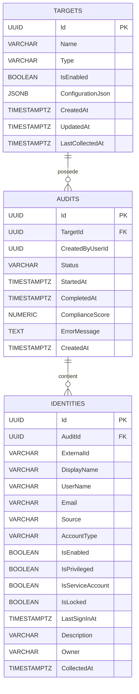
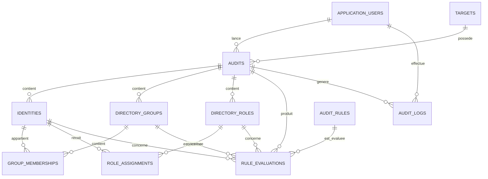

# Schéma logique de la base de données

## 1. Principe général

Chaque audit constitue une photographie des données collectées à un moment précis.

Une cible peut donc posséder plusieurs audits. Chaque audit conserve ses propres identités ainsi que, dans les prochaines versions, ses groupes, rôles, relations et résultats de règles.

Le lien principal est le suivant :

```text
Target
  ↓
Audit
  ↓
Identities, DirectoryGroups, DirectoryRoles et RuleEvaluations
```

Cette organisation permet de :

- conserver l’historique des audits ;
- comparer plusieurs audits d’une même cible ;
- éviter d’écraser les anciennes données ;
- calculer un score de conformité propre à chaque audit ;
- produire des preuves et des recommandations liées à une collecte précise.

## 2. État d’implémentation

La base actuelle contient les tables suivantes :

```text
Targets
Audits
Identities
__EFMigrationsHistory
```

Les objets PostgreSQL suivants sont également déjà créés :

```text
IX_Audits_TargetId_CreatedAt
IX_Identities_AuditId_ExternalId
vw_AuditDashboardSummary
fn_GetTargetDashboard(uuid)
```

Les tables suivantes appartiennent au modèle prévisionnel et seront ajoutées progressivement :

```text
ApplicationUsers
DirectoryGroups
GroupMemberships
DirectoryRoles
RoleAssignments
AuditRules
RuleEvaluations
AuditLogs
```

Cette distinction évite de confondre le schéma réellement implémenté avec le schéma cible du projet.

## 3. Diagramme du schéma actuellement implémenté



## 4. Diagramme cible prévisionnel



## 5. Tables actuellement implémentées

### 5.1 Targets

La table `Targets` contient les environnements à auditer.

| Colonne           | Type                 | Description                            |
| ----------------- | -------------------- | -------------------------------------- |
| Id                | UUID                 | Clé primaire                           |
| Name              | VARCHAR(255)         | Nom de la cible                        |
| Type              | VARCHAR(30)          | `EntraId` ou `ActiveDirectory`         |
| IsEnabled         | BOOLEAN              | Indique si la cible est activée        |
| ConfigurationJson | JSONB nullable       | Configuration non sensible de la cible |
| CreatedAt         | TIMESTAMPTZ          | Date de création                       |
| UpdatedAt         | TIMESTAMPTZ          | Date de dernière modification          |
| LastCollectedAt   | TIMESTAMPTZ nullable | Date de la dernière collecte terminée  |

Les mots de passe, secrets, clés privées et jetons ne doivent pas être stockés directement dans `ConfigurationJson`.

### 5.2 Audits

La table `Audits` contient les audits lancés sur les cibles.

| Colonne         | Type                  | Description                                      |
| --------------- | --------------------- | ------------------------------------------------ |
| Id              | UUID                  | Clé primaire                                     |
| TargetId        | UUID                  | Clé étrangère vers `Targets`                     |
| CreatedByUserId | UUID nullable         | Futur utilisateur ayant lancé l’audit            |
| Status          | VARCHAR(40)           | `Pending`, `Running` ou `Completed` actuellement |
| StartedAt       | TIMESTAMPTZ nullable  | Date de démarrage de l’audit                     |
| CompletedAt     | TIMESTAMPTZ nullable  | Date de fin de l’audit                           |
| ComplianceScore | NUMERIC(5,2) nullable | Futur score de conformité entre 0 et 100         |
| ErrorMessage    | TEXT nullable         | Message d’erreur éventuel                        |
| CreatedAt       | TIMESTAMPTZ           | Date de création                                 |

La relation entre `Targets` et `Audits` utilise une suppression restreinte. Une cible ne doit pas être supprimée automatiquement lorsqu’elle possède des audits.

### 5.3 Identities

La table `Identities` contient les comptes collectés pendant un audit.

| Colonne          | Type                   | Description                                          |
| ---------------- | ---------------------- | ---------------------------------------------------- |
| Id               | UUID                   | Clé primaire                                         |
| AuditId          | UUID                   | Clé étrangère vers `Audits`                          |
| ExternalId       | VARCHAR(512)           | Identifiant de l’objet dans l’annuaire source        |
| DisplayName      | VARCHAR(255)           | Nom d’affichage                                      |
| UserName         | VARCHAR(255)           | Nom de connexion                                     |
| Email            | VARCHAR(320) nullable  | Adresse électronique                                 |
| Source           | VARCHAR(30)            | `EntraId` ou `ActiveDirectory`                       |
| AccountType      | VARCHAR(30)            | `User`, `Guest`, `Administrator` ou `ServiceAccount` |
| IsEnabled        | BOOLEAN                | Compte actif ou désactivé                            |
| IsPrivileged     | BOOLEAN                | Compte privilégié ou non                             |
| IsServiceAccount | BOOLEAN                | Compte de service ou non                             |
| IsLocked         | BOOLEAN nullable       | Compte verrouillé ou non                             |
| LastSignInAt     | TIMESTAMPTZ nullable   | Date de dernière connexion connue                    |
| Description      | VARCHAR(2000) nullable | Description du compte                                |
| Owner            | VARCHAR(255) nullable  | Propriétaire ou responsable du compte                |
| CollectedAt      | TIMESTAMPTZ            | Date de collecte                                     |

Le champ `MfaStatus` n’est pas encore implémenté dans la table actuelle. Il pourra être ajouté ultérieurement lorsque le collecteur Microsoft Entra ID disposera des permissions nécessaires.

Une contrainte d’unicité est appliquée sur :

```text
AuditId + ExternalId
```

Elle empêche l’enregistrement plusieurs fois du même objet externe dans un même audit.

La relation entre `Audits` et `Identities` utilise une suppression en cascade. La suppression contrôlée d’un audit supprime donc les identités qui lui appartiennent.

## 6. Tables prévisionnelles

### 6.1 ApplicationUsers

La table `ApplicationUsers` contiendra les utilisateurs autorisés à accéder à l’application.

| Colonne      | Type         | Description                            |
| ------------ | ------------ | -------------------------------------- |
| Id           | UUID         | Clé primaire                           |
| Email        | VARCHAR(255) | Adresse de connexion unique            |
| PasswordHash | TEXT         | Empreinte sécurisée du mot de passe    |
| DisplayName  | VARCHAR(255) | Nom d’affichage                        |
| Role         | VARCHAR(30)  | `Administrator`, `Auditor` ou `Reader` |
| IsActive     | BOOLEAN      | État du compte                         |
| CreatedAt    | TIMESTAMPTZ  | Date de création                       |
| UpdatedAt    | TIMESTAMPTZ  | Date de modification                   |

Aucun mot de passe ne devra être stocké en clair.

### 6.2 DirectoryGroups

La table `DirectoryGroups` contiendra les groupes collectés pendant un audit.

| Colonne      | Type                   | Description                           |
| ------------ | ---------------------- | ------------------------------------- |
| Id           | UUID                   | Clé primaire                          |
| AuditId      | UUID                   | Clé étrangère vers `Audits`           |
| ExternalId   | VARCHAR(512)           | Identifiant du groupe dans l’annuaire |
| Name         | VARCHAR(255)           | Nom du groupe                         |
| Description  | VARCHAR(2000) nullable | Description du groupe                 |
| Source       | VARCHAR(30)            | `EntraId` ou `ActiveDirectory`        |
| GroupType    | VARCHAR(50) nullable   | Type du groupe                        |
| IsPrivileged | BOOLEAN                | Groupe sensible ou privilégié         |
| CollectedAt  | TIMESTAMPTZ            | Date de collecte                      |

Une contrainte d’unicité devra être créée sur :

```text
AuditId + ExternalId
```

### 6.3 GroupMemberships

La table `GroupMemberships` représentera les appartenances des identités aux groupes.

| Colonne        | Type        | Description                          |
| -------------- | ----------- | ------------------------------------ |
| Id             | UUID        | Clé primaire                         |
| IdentityId     | UUID        | Clé étrangère vers `Identities`      |
| GroupId        | UUID        | Clé étrangère vers `DirectoryGroups` |
| MembershipType | VARCHAR(20) | `Direct` ou `Indirect`               |
| CollectedAt    | TIMESTAMPTZ | Date de collecte                     |

Une contrainte d’unicité devra être créée sur :

```text
IdentityId + GroupId
```

Les deux objets reliés devront appartenir au même audit.

### 6.4 DirectoryRoles

La table `DirectoryRoles` contiendra les rôles collectés.

| Colonne      | Type                   | Description                    |
| ------------ | ---------------------- | ------------------------------ |
| Id           | UUID                   | Clé primaire                   |
| AuditId      | UUID                   | Clé étrangère vers `Audits`    |
| ExternalId   | VARCHAR(512)           | Identifiant externe du rôle    |
| Name         | VARCHAR(255)           | Nom du rôle                    |
| Description  | VARCHAR(2000) nullable | Description du rôle            |
| Source       | VARCHAR(30)            | `EntraId` ou `ActiveDirectory` |
| IsPrivileged | BOOLEAN                | Rôle sensible ou privilégié    |
| CollectedAt  | TIMESTAMPTZ            | Date de collecte               |

Une contrainte d’unicité devra être créée sur :

```text
AuditId + ExternalId
```

### 6.5 RoleAssignments

La table `RoleAssignments` représentera les rôles attribués aux identités.

| Colonne         | Type                 | Description                          |
| --------------- | -------------------- | ------------------------------------ |
| Id              | UUID                 | Clé primaire                         |
| IdentityId      | UUID                 | Clé étrangère vers `Identities`      |
| DirectoryRoleId | UUID                 | Clé étrangère vers `DirectoryRoles`  |
| AssignedAt      | TIMESTAMPTZ nullable | Date d’attribution connue            |
| ExpiresAt       | TIMESTAMPTZ nullable | Date d’expiration éventuelle         |
| IsPermanent     | BOOLEAN              | Attribution permanente ou temporaire |
| CollectedAt     | TIMESTAMPTZ          | Date de collecte                     |

L’identité et le rôle reliés devront appartenir au même audit.

### 6.6 AuditRules

La table `AuditRules` contiendra le catalogue des règles d’audit.

| Colonne        | Type         | Description                            |
| -------------- | ------------ | -------------------------------------- |
| Id             | UUID         | Clé primaire                           |
| Code           | VARCHAR(30)  | Code unique, par exemple `AD-01`       |
| Name           | VARCHAR(255) | Nom de la règle                        |
| Description    | TEXT         | Description                            |
| CisControl     | VARCHAR(30)  | Référence au contrôle ou Safeguard CIS |
| TargetType     | VARCHAR(30)  | `EntraId` ou `ActiveDirectory`         |
| Severity       | VARCHAR(20)  | `Critical`, `High`, `Medium` ou `Low`  |
| Recommendation | TEXT         | Recommandation                         |
| IsEnabled      | BOOLEAN      | Règle active ou non                    |
| CreatedAt      | TIMESTAMPTZ  | Date de création                       |
| UpdatedAt      | TIMESTAMPTZ  | Date de modification                   |

### 6.7 RuleEvaluations

La table `RuleEvaluations` contiendra tous les résultats des règles, et pas seulement les anomalies.

| Colonne          | Type                  | Description                                                     |
| ---------------- | --------------------- | --------------------------------------------------------------- |
| Id               | UUID                  | Clé primaire                                                    |
| AuditId          | UUID                  | Clé étrangère vers `Audits`                                     |
| AuditRuleId      | UUID                  | Clé étrangère vers `AuditRules`                                 |
| IdentityId       | UUID nullable         | Identité concernée                                              |
| DirectoryGroupId | UUID nullable         | Groupe concerné                                                 |
| DirectoryRoleId  | UUID nullable         | Rôle concerné                                                   |
| Status           | VARCHAR(30)           | `Compliant`, `NonCompliant`, `NotApplicable` ou `NotVerifiable` |
| Severity         | VARCHAR(20)           | Gravité du résultat                                             |
| ObjectType       | VARCHAR(50) nullable  | Type de l’objet concerné                                        |
| ObjectName       | VARCHAR(255) nullable | Nom de l’objet concerné                                         |
| Evidence         | TEXT nullable         | Preuve de l’évaluation                                          |
| Recommendation   | TEXT nullable         | Recommandation                                                  |
| EvaluatedAt      | TIMESTAMPTZ           | Date d’évaluation                                               |

Les anomalies affichées dans l’application correspondront aux résultats ayant le statut :

```text
NonCompliant
```

### 6.8 AuditLogs

La table `AuditLogs` contiendra les événements importants de l’application.

| Colonne           | Type          | Description                         |
| ----------------- | ------------- | ----------------------------------- |
| Id                | UUID          | Clé primaire                        |
| AuditId           | UUID nullable | Audit concerné                      |
| ApplicationUserId | UUID nullable | Utilisateur concerné                |
| Level             | VARCHAR(20)   | `Information`, `Warning` ou `Error` |
| EventType         | VARCHAR(100)  | Type de l’événement                 |
| Message           | TEXT          | Description de l’événement          |
| CreatedAt         | TIMESTAMPTZ   | Date de création                    |

## 7. Index actuellement créés

### 7.1 Index des audits

L’index suivant est créé sur la table `Audits` :

```text
IX_Audits_TargetId_CreatedAt
```

Définition :

```sql
CREATE INDEX "IX_Audits_TargetId_CreatedAt"
ON public."Audits" ("TargetId", "CreatedAt" DESC);
```

Il optimise les requêtes qui recherchent les audits d’une cible et les classent du plus récent au plus ancien.

### 7.2 Index unique des identités

L’index suivant est créé sur la table `Identities` :

```text
IX_Identities_AuditId_ExternalId
```

Définition logique :

```sql
CREATE UNIQUE INDEX "IX_Identities_AuditId_ExternalId"
ON public."Identities" ("AuditId", "ExternalId");
```

Il garantit l’unicité d’une identité externe dans un audit.

Comme `AuditId` constitue la première colonne de l’index, PostgreSQL peut également l’utiliser pour rechercher les identités d’un audit.

## 8. Vue et fonction du tableau de bord

### 8.1 Vue `vw_AuditDashboardSummary`

La vue PostgreSQL suivante est actuellement créée :

```text
vw_AuditDashboardSummary
```

Elle agrège les données provenant de :

```text
Targets
Audits
Identities
```

Elle retourne notamment, pour chaque audit :

- l’identifiant de l’audit ;
- l’identifiant et le nom de la cible ;
- le type de la cible ;
- le statut et les dates de l’audit ;
- le score de conformité ;
- le nombre total d’identités ;
- le nombre de comptes actifs ;
- le nombre de comptes désactivés ;
- le nombre de comptes privilégiés ;
- le nombre de comptes de service ;
- le nombre de comptes invités ;
- le nombre de comptes verrouillés.

Il s’agit d’une vue normale. Les résultats ne sont pas stockés physiquement comme dans une vue matérialisée.

### 8.2 Fonction `fn_GetTargetDashboard(uuid)`

La fonction suivante est actuellement créée :

```text
fn_GetTargetDashboard(uuid)
```

Elle prend l’identifiant d’une cible en paramètre, filtre les résultats de la vue et les classe avec :

```sql
ORDER BY "CreatedAt" DESC
```

Elle est utilisée par l’endpoint :

```http
GET /api/dashboard/targets/{targetId}
```

## 9. Calcul prévisionnel du score de conformité

Le score sera calculé uniquement avec les résultats :

- `Compliant` ;
- `NonCompliant`.

Les résultats suivants seront exclus :

- `NotApplicable` ;
- `NotVerifiable`.

Formule prévue :

```text
Nombre de résultats Compliant
──────────────────────────────────────── × 100
Nombre de résultats Compliant + NonCompliant
```

Tant que le moteur de règles CIS n’est pas implémenté, la colonne `ComplianceScore` peut rester nulle.

## 10. Règles importantes de conception

- Les identités, groupes et rôles sont associés à un audit précis.
- Une cible peut posséder plusieurs audits.
- Les données collectées précédemment ne sont pas écrasées.
- Les identifiants externes ne sont pas utilisés comme clés primaires.
- Les contraintes d’unicité incluent l’identifiant de l’audit.
- Toutes les dates sont enregistrées avec un fuseau horaire.
- Les secrets ne sont jamais stockés en clair.
- Les collecteurs ne se connectent pas directement à PostgreSQL.
- Les suppressions en cascade sont limitées et contrôlées.
- La suppression d’une cible possédant des audits est restreinte.
- La suppression contrôlée d’un audit supprime les identités associées.
- Les index sont ajoutés uniquement lorsqu’ils correspondent à des requêtes réelles.
- Les règles métier et les règles CIS restent exécutées dans le backend.
