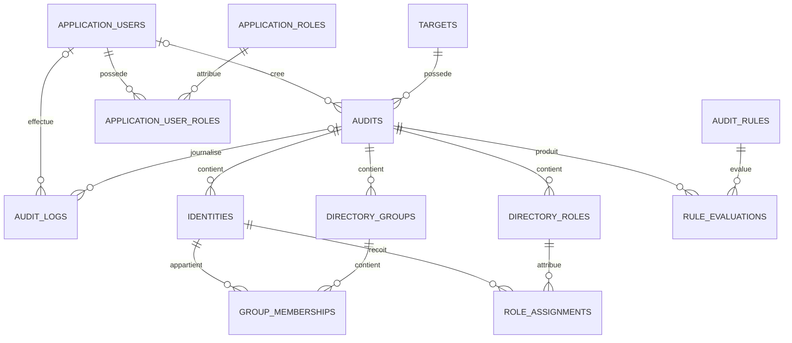

# Schéma logique de la base de données

## 1. Principe général

Chaque audit constitue une photographie indépendante des données collectées à un moment précis.

```text
Cible
└── Audit
    ├── Identités
    ├── Groupes
    │   └── Appartenances
    ├── Rôles
    │   └── Affectations
    ├── Évaluations CIS
    └── Journaux
```

Une cible peut donc posséder plusieurs audits sans que les nouvelles collectes écrasent les anciennes.

Cette organisation permet :

- de conserver l’historique ;
- de comparer plusieurs audits ;
- de calculer un score propre à chaque collecte ;
- de conserver les preuves et recommandations ;
- de retrouver les opérations effectuées par les utilisateurs et collecteurs.

## 2. État d’implémentation

Le schéma prévu est désormais implémenté.

PostgreSQL contient 18 tables :

```text
ApplicationRoleClaims
ApplicationRoles
ApplicationUserClaims
ApplicationUserLogins
ApplicationUserRoles
ApplicationUserTokens
ApplicationUsers
AuditLogs
AuditRules
Audits
DirectoryGroups
DirectoryRoles
GroupMemberships
Identities
RoleAssignments
RuleEvaluations
Targets
__EFMigrationsHistory
```

Les tables commençant par `Application` appartiennent à ASP.NET Core Identity.

Les autres tables représentent les données métier d’Identity Audit.

## 3. Diagramme relationnel



`CreatedByUserId`, `AuditLog.AuditId` et `AuditLog.ApplicationUserId` sont facultatifs.

Cela permet notamment de conserver un journal même si l’événement n’est pas associé à un audit ou si l’utilisateur concerné est supprimé.

## 4. Tables principales

### 4.1 Targets

La table `Targets` contient les environnements à auditer.

| Colonne             | Type         | Nullable | Description                    |
| ------------------- | ------------ | -------- | ------------------------------ |
| `Id`                | UUID         | Non      | Clé primaire                   |
| `Name`              | VARCHAR(255) | Non      | Nom de la cible                |
| `Type`              | VARCHAR(30)  | Non      | `EntraId` ou `ActiveDirectory` |
| `IsEnabled`         | BOOLEAN      | Non      | Cible active ou désactivée     |
| `ConfigurationJson` | JSONB        | Oui      | Configuration non sensible     |
| `CreatedAt`         | TIMESTAMPTZ  | Non      | Date de création               |
| `UpdatedAt`         | TIMESTAMPTZ  | Non      | Date de modification           |
| `LastCollectedAt`   | TIMESTAMPTZ  | Oui      | Dernière collecte terminée     |

Les mots de passe, secrets, JWT et clés privées ne doivent pas être stockés dans `ConfigurationJson`.

### 4.2 Audits

La table `Audits` représente les sessions d’audit.

| Colonne           | Type        | Nullable | Description                                  |
| ----------------- | ----------- | -------- | -------------------------------------------- |
| `Id`              | UUID        | Non      | Clé primaire                                 |
| `TargetId`        | UUID        | Non      | Cible auditée                                |
| `CreatedByUserId` | UUID        | Oui      | Utilisateur ou collecteur ayant créé l’audit |
| `Status`          | VARCHAR(40) | Non      | État de l’audit                              |
| `StartedAt`       | TIMESTAMPTZ | Oui      | Date de démarrage                            |
| `CompletedAt`     | TIMESTAMPTZ | Oui      | Date de fin                                  |
| `ComplianceScore` | NUMERIC     | Oui      | Score entre 0 et 100                         |
| `ErrorMessage`    | TEXT        | Oui      | Erreur éventuelle                            |
| `CreatedAt`       | TIMESTAMPTZ | Non      | Date de création                             |

États principalement utilisés :

```text
Pending
Running
Completed
Failed
```

La suppression d’une cible possédant des audits est restreinte afin de préserver l’historique.

### 4.3 Identities

La table `Identities` contient les comptes collectés.

| Colonne            | Type          | Nullable | Description                 |
| ------------------ | ------------- | -------- | --------------------------- |
| `Id`               | UUID          | Non      | Clé primaire                |
| `AuditId`          | UUID          | Non      | Audit propriétaire          |
| `ExternalId`       | VARCHAR(512)  | Non      | Identifiant dans l’annuaire |
| `DisplayName`      | VARCHAR(255)  | Non      | Nom d’affichage             |
| `UserName`         | VARCHAR(255)  | Non      | Nom de connexion            |
| `Email`            | VARCHAR(320)  | Oui      | Adresse électronique        |
| `Source`           | VARCHAR(30)   | Non      | Source de la collecte       |
| `AccountType`      | VARCHAR(30)   | Non      | Type de compte              |
| `IsEnabled`        | BOOLEAN       | Non      | Compte actif                |
| `IsPrivileged`     | BOOLEAN       | Non      | Compte privilégié           |
| `IsServiceAccount` | BOOLEAN       | Non      | Compte de service           |
| `IsLocked`         | BOOLEAN       | Oui      | Compte verrouillé           |
| `LastSignInAt`     | TIMESTAMPTZ   | Oui      | Dernière connexion connue   |
| `Description`      | VARCHAR(2000) | Oui      | Description                 |
| `Owner`            | VARCHAR(255)  | Oui      | Propriétaire du compte      |
| `CollectedAt`      | TIMESTAMPTZ   | Non      | Date de collecte            |

L’unicité logique est assurée par :

```text
AuditId + ExternalId
```

Le même objet externe peut exister dans plusieurs audits, mais une seule fois dans un audit déterminé.

### 4.4 DirectoryGroups

La table `DirectoryGroups` contient les groupes collectés.

| Colonne        | Type          | Nullable | Description         |
| -------------- | ------------- | -------- | ------------------- |
| `Id`           | UUID          | Non      | Clé primaire        |
| `AuditId`      | UUID          | Non      | Audit propriétaire  |
| `ExternalId`   | VARCHAR(512)  | Non      | Identifiant externe |
| `Name`         | VARCHAR(255)  | Non      | Nom du groupe       |
| `Description`  | VARCHAR(2000) | Oui      | Description         |
| `Source`       | VARCHAR(30)   | Non      | Source              |
| `GroupType`    | VARCHAR(100)  | Oui      | Type du groupe      |
| `IsPrivileged` | BOOLEAN       | Non      | Groupe privilégié   |
| `CollectedAt`  | TIMESTAMPTZ   | Non      | Date de collecte    |

L’unicité logique est :

```text
AuditId + ExternalId
```

### 4.5 GroupMemberships

La table `GroupMemberships` relie les identités et les groupes.

| Colonne          | Type        | Nullable | Description                        |
| ---------------- | ----------- | -------- | ---------------------------------- |
| `Id`             | UUID        | Non      | Clé primaire                       |
| `IdentityId`     | UUID        | Non      | Identité membre                    |
| `GroupId`        | UUID        | Non      | Groupe concerné                    |
| `MembershipType` | VARCHAR(30) | Non      | Appartenance directe ou transitive |
| `CollectedAt`    | TIMESTAMPTZ | Non      | Date de collecte                   |

Une même relation identité-groupe ne doit pas être enregistrée plusieurs fois dans un audit.

### 4.6 DirectoryRoles

La table `DirectoryRoles` contient les rôles d’annuaire.

| Colonne        | Type          | Nullable | Description         |
| -------------- | ------------- | -------- | ------------------- |
| `Id`           | UUID          | Non      | Clé primaire        |
| `AuditId`      | UUID          | Non      | Audit propriétaire  |
| `ExternalId`   | VARCHAR(512)  | Non      | Identifiant externe |
| `Name`         | VARCHAR(255)  | Non      | Nom du rôle         |
| `Description`  | VARCHAR(2000) | Oui      | Description         |
| `Source`       | VARCHAR(30)   | Non      | Source              |
| `IsPrivileged` | BOOLEAN       | Non      | Rôle privilégié     |
| `CollectedAt`  | TIMESTAMPTZ   | Non      | Date de collecte    |

L’unicité logique est :

```text
AuditId + ExternalId
```

### 4.7 RoleAssignments

La table `RoleAssignments` relie une identité à un rôle d’annuaire.

| Colonne           | Type        | Nullable | Description            |
| ----------------- | ----------- | -------- | ---------------------- |
| `Id`              | UUID        | Non      | Clé primaire           |
| `IdentityId`      | UUID        | Non      | Identité concernée     |
| `DirectoryRoleId` | UUID        | Non      | Rôle attribué          |
| `AssignedAt`      | TIMESTAMPTZ | Oui      | Date d’attribution     |
| `ExpiresAt`       | TIMESTAMPTZ | Oui      | Date d’expiration      |
| `IsPermanent`     | BOOLEAN     | Non      | Attribution permanente |
| `CollectedAt`     | TIMESTAMPTZ | Non      | Date de collecte       |

L’identité et le rôle doivent appartenir au même audit.

### 4.8 AuditRules

La table `AuditRules` contient le catalogue des règles CIS.

| Colonne          | Type          | Nullable | Description          |
| ---------------- | ------------- | -------- | -------------------- |
| `Id`             | UUID          | Non      | Clé primaire         |
| `Code`           | VARCHAR(50)   | Non      | Code unique          |
| `Name`           | VARCHAR(255)  | Non      | Nom                  |
| `Description`    | VARCHAR(2000) | Non      | Description          |
| `CisControl`     | VARCHAR(50)   | Non      | Contrôle CIS         |
| `Severity`       | VARCHAR(30)   | Non      | Gravité              |
| `Recommendation` | VARCHAR(2000) | Non      | Recommandation       |
| `IsEnabled`      | BOOLEAN       | Non      | Règle active         |
| `CreatedAt`      | TIMESTAMPTZ   | Non      | Date de création     |
| `UpdatedAt`      | TIMESTAMPTZ   | Non      | Date de modification |
| `TargetType`     | VARCHAR(30)   | Non      | Type de cible        |

`TargetType` permet d’exécuter uniquement les règles compatibles avec la source :

```text
EntraId
ActiveDirectory
```

### 4.9 RuleEvaluations

La table `RuleEvaluations` contient les résultats produits par le moteur CIS.

| Colonne          | Type          | Nullable | Description         |
| ---------------- | ------------- | -------- | ------------------- |
| `Id`             | UUID          | Non      | Clé primaire        |
| `AuditId`        | UUID          | Non      | Audit évalué        |
| `AuditRuleId`    | UUID          | Non      | Règle évaluée       |
| `Status`         | VARCHAR(30)   | Non      | Statut              |
| `FindingCount`   | INTEGER       | Non      | Nombre de constats  |
| `EvidenceJson`   | JSONB         | Oui      | Preuves structurées |
| `Recommendation` | VARCHAR(2000) | Oui      | Recommandation      |
| `ErrorMessage`   | TEXT          | Oui      | Erreur d’évaluation |
| `EvaluatedAt`    | TIMESTAMPTZ   | Non      | Date d’évaluation   |

Statuts possibles :

```text
Compliant
NonCompliant
NotApplicable
NotVerifiable
Error
```

Contrairement à l’ancien modèle prévisionnel, les objets concernés ne sont pas reliés individuellement avec plusieurs clés étrangères.

Les preuves détaillées sont conservées dans `EvidenceJson`.

### 4.10 AuditLogs

La table `AuditLogs` conserve les événements importants associés aux audits.

| Colonne             | Type         | Nullable | Description        |
| ------------------- | ------------ | -------- | ------------------ |
| `Id`                | UUID         | Non      | Clé primaire       |
| `AuditId`           | UUID         | Oui      | Audit concerné     |
| `ApplicationUserId` | UUID         | Oui      | Auteur de l’action |
| `Level`             | VARCHAR(20)  | Non      | Niveau             |
| `EventType`         | VARCHAR(100) | Non      | Type d’événement   |
| `Message`           | TEXT         | Non      | Description        |
| `CreatedAt`         | TIMESTAMPTZ  | Non      | Date de création   |

Niveaux :

```text
Information
Warning
Error
```

Événements actuellement enregistrés :

```text
AuditCreated
AuditStarted
AuditCompleted
AuditRulesEvaluated
AuditExported
```

Les relations vers `Audits` et `ApplicationUsers` utilisent `ON DELETE SET NULL`.

Cette stratégie permet de conserver la trace de l’événement même si son audit ou son auteur est supprimé.

## 5. Utilisateurs et rôles applicatifs

### 5.1 ApplicationUsers

La table `ApplicationUsers` est gérée par ASP.NET Core Identity.

Champs personnalisés :

| Colonne       | Type         | Nullable | Description          |
| ------------- | ------------ | -------- | -------------------- |
| `Id`          | UUID         | Non      | Clé primaire         |
| `DisplayName` | VARCHAR(255) | Non      | Nom affiché          |
| `IsEnabled`   | BOOLEAN      | Non      | Compte autorisé      |
| `CreatedAt`   | TIMESTAMPTZ  | Non      | Date de création     |
| `UpdatedAt`   | TIMESTAMPTZ  | Non      | Date de modification |

Elle contient également les champs Identity :

- `UserName` ;
- `NormalizedUserName` ;
- `Email` ;
- `NormalizedEmail` ;
- `EmailConfirmed` ;
- `PasswordHash` ;
- `SecurityStamp` ;
- `ConcurrencyStamp` ;
- `PhoneNumber` ;
- `PhoneNumberConfirmed` ;
- `TwoFactorEnabled` ;
- `LockoutEnd` ;
- `LockoutEnabled` ;
- `AccessFailedCount`.

Les mots de passe sont stockés uniquement sous forme d’empreinte sécurisée dans `PasswordHash`.

### 5.2 ApplicationRoles

La table `ApplicationRoles` contient :

| Colonne            | Type         | Nullable |
| ------------------ | ------------ | -------- |
| `Id`               | UUID         | Non      |
| `Name`             | VARCHAR(256) | Oui      |
| `NormalizedName`   | VARCHAR(256) | Oui      |
| `ConcurrencyStamp` | TEXT         | Oui      |

Rôles initialisés :

```text
Administrator
Auditor
Reader
```

### 5.3 ApplicationUserRoles

Cette table d’association contient :

| Colonne  | Type | Nullable |
| -------- | ---- | -------- |
| `UserId` | UUID | Non      |
| `RoleId` | UUID | Non      |

Un utilisateur peut posséder plusieurs rôles.

### 5.4 Tables auxiliaires Identity

ASP.NET Core Identity crée également :

```text
ApplicationRoleClaims
ApplicationUserClaims
ApplicationUserLogins
ApplicationUserTokens
```

Ces tables prennent en charge les fonctionnalités standard d’identité et d’authentification.

## 6. Relations et suppressions

Principales relations :

| Parent             | Enfant             | Comportement           |
| ------------------ | ------------------ | ---------------------- |
| `Targets`          | `Audits`           | Suppression restreinte |
| `Audits`           | `Identities`       | Cascade                |
| `Audits`           | `DirectoryGroups`  | Cascade                |
| `Audits`           | `DirectoryRoles`   | Cascade                |
| `Audits`           | `RuleEvaluations`  | Cascade                |
| `Identities`       | `GroupMemberships` | Cascade                |
| `DirectoryGroups`  | `GroupMemberships` | Cascade                |
| `Identities`       | `RoleAssignments`  | Cascade                |
| `DirectoryRoles`   | `RoleAssignments`  | Cascade                |
| `AuditRules`       | `RuleEvaluations`  | Suppression restreinte |
| `Audits`           | `AuditLogs`        | Mise à null            |
| `ApplicationUsers` | `AuditLogs`        | Mise à null            |

Les suppressions d’audits ne sont pas exposées comme une opération courante de l’API.

## 7. Index importants

### 7.1 Audits

```text
IX_Audits_TargetId_CreatedAt
```

Il optimise la recherche des audits d’une cible du plus récent au plus ancien.

### 7.2 Objets collectés

Les identités, groupes et rôles utilisent des index d’unicité basés sur :

```text
AuditId + ExternalId
```

Ils empêchent les doublons dans un même audit.

### 7.3 Relations

Les appartenances et affectations possèdent des index sur leurs clés étrangères et leurs couples d’identifiants.

Ils améliorent la consultation des membres d’un groupe et des rôles d’une identité.

### 7.4 Journaux

```text
IX_AuditLogs_AuditId_CreatedAt
IX_AuditLogs_ApplicationUserId_CreatedAt
```

Ces index optimisent :

- le journal d’un audit ;
- la recherche des événements d’un utilisateur ;
- le tri antéchronologique.

## 8. Vue et fonction PostgreSQL

### 8.1 Vue du tableau de bord

```text
vw_AuditDashboardSummary
```

Elle centralise les indicateurs nécessaires au tableau de bord :

- nombre d’identités ;
- comptes actifs ;
- comptes désactivés ;
- comptes privilégiés ;
- comptes de service ;
- comptes invités ;
- comptes verrouillés ;
- résultats CIS ;
- score de conformité.

### 8.2 Fonction du tableau de bord

```text
fn_GetTargetDashboard(uuid)
```

Elle récupère les indicateurs associés à une cible.

Ces objets optimisent les lectures sans déplacer le moteur de règles dans PostgreSQL.

## 9. Migrations Entity Framework Core

Les migrations appliquées sont :

| Migration                          | Version EF Core |
| ---------------------------------- | --------------- |
| `InitialCreate`                    | `10.0.4`        |
| `AddIdentities`                    | `10.0.4`        |
| `OptimizePostgresqlDashboard`      | `10.0.4`        |
| `AddDirectoryGroupsAndMemberships` | `10.0.4`        |
| `AddDirectoryRolesAndAssignments`  | `10.0.4`        |
| `AddAuditRulesAndEvaluations`      | `10.0.4`        |
| `AddAuditRuleTargetType`           | `10.0.4`        |
| `RemoveAuditRuleTargetTypeDefault` | `10.0.4`        |
| `EnrichDashboardWithCisMetrics`    | `10.0.4`        |
| `AddApplicationUsersAndRoles`      | `10.0.10`       |
| `AddAuditLogs`                     | `10.0.10`       |

La différence entre `10.0.4` et `10.0.10` indique la version utilisée au moment de la création de chaque migration.

Les anciennes lignes ne doivent pas être modifiées manuellement.

## 10. Sécurité des données

Les informations suivantes ne sont pas stockées dans les tables métier :

- mot de passe Active Directory en clair ;
- mot de passe API en clair ;
- JWT ;
- clé privée du certificat LDAPS ;
- secret Microsoft Entra ID.

Les secrets sont fournis au moment de l’exécution par configuration locale ou variables d’environnement.

Les journaux ne contiennent ni mot de passe ni JWT.

## 11. Vérifications utiles

Lister les tables :

```bash
psql \
-d identity_audit \
-P pager=off \
-c '\dt'
```

Afficher les migrations :

```bash
psql \
-d identity_audit \
-P pager=off \
-c '
SELECT
    "MigrationId",
    "ProductVersion"
FROM "__EFMigrationsHistory"
ORDER BY "MigrationId";'
```

Vérifier les journaux :

```bash
psql \
-d identity_audit \
-P pager=off \
-c '
SELECT
    "EventType",
    "Level",
    "AuditId",
    "ApplicationUserId",
    "CreatedAt"
FROM "AuditLogs"
ORDER BY "CreatedAt" DESC;'
```
