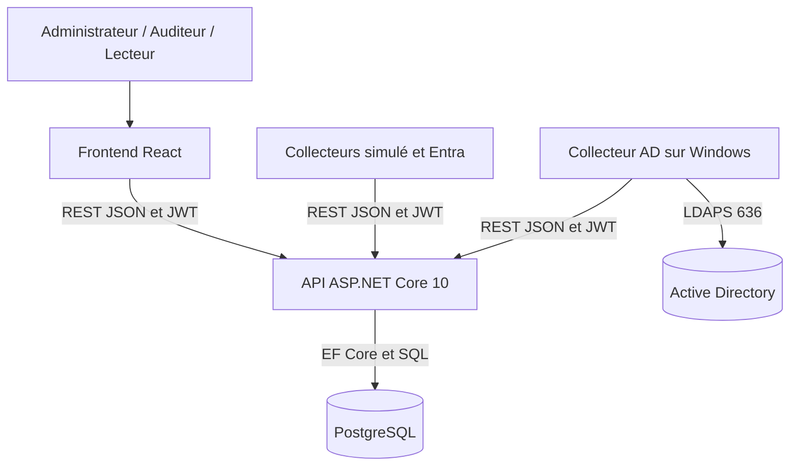
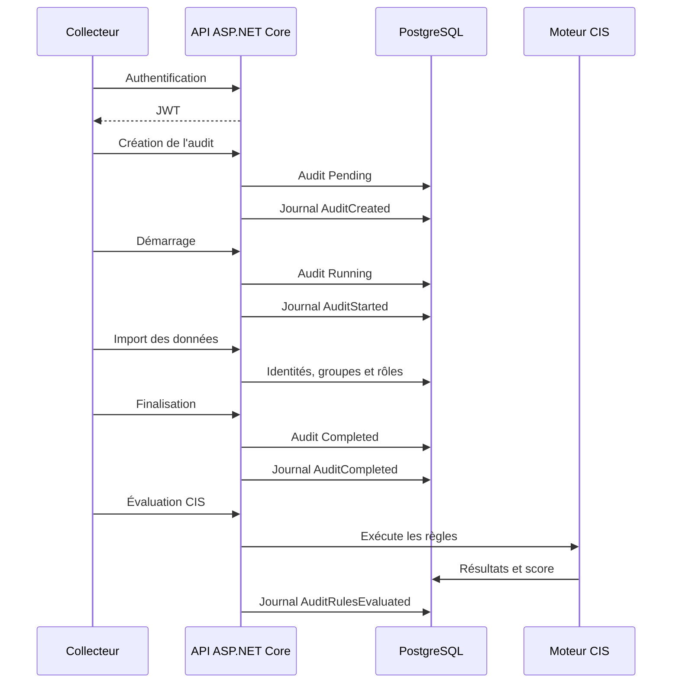

# Architecture technique

## 1. Objectif

Identity Audit collecte, centralise et analyse les identités et privilèges provenant de :

- Microsoft Entra ID ;
- Active Directory On-Premise.

L’application applique des règles liées aux CIS Controls 5 et 6 afin de produire :

- un score de conformité ;
- des constats ;
- des preuves ;
- des recommandations ;
- un historique des opérations.

## 2. Architecture réellement mise en œuvre



Le projet utilise une architecture monolithique en couches pour le backend et des exécutables séparés pour les collecteurs.

## 3. Répartition entre les machines

### 3.1 Mac

Le Mac héberge principalement :

- le code source ;
- l’API ASP.NET Core ;
- PostgreSQL ;
- le frontend React ;
- le collecteur simulé ;
- le collecteur Entra ID simulé ;
- les tests ;
- Git et la documentation.

Pour permettre au collecteur Windows de joindre l’API :

```bash
dotnet run \
--project backend/IdentityAudit.Api \
-- \
--urls http://0.0.0.0:5173
```

L’API est alors accessible depuis Windows avec l’adresse du Mac :

```text
http://<IP-MAC>:5173
```

### 3.2 Windows

Windows héberge :

- le collecteur Active Directory publié en `win-x64` ;
- le certificat public de l’autorité de certification du laboratoire ;
- les variables de configuration LDAP et API.

Le collecteur communique avec :

```text
API sur le Mac
└── HTTP + JWT

Contrôleur de domaine
└── LDAPS 636
```

### 3.3 Contrôleur de domaine

Le contrôleur de domaine utilisé dans le laboratoire est :

```text
LAB-DC01.identityaudit.test:636
```

La connexion utilise LDAPS avec validation du certificat serveur.

LDAP simple sur le port `389` n’est pas utilisé dans le laboratoire, car Active Directory exige une authentification forte. La configuration du domaine n’a pas été affaiblie.

## 4. Frontend React

Le frontend constitue l’interface des administrateurs, auditeurs et lecteurs.

Il est développé avec :

- React 19 ;
- TypeScript 6 ;
- Vite 8 ;
- React Router DOM ;
- Axios ;
- Lucide React ;
- CSS.

Fonctionnalités principales :

- authentification ;
- tableau de bord ;
- gestion des cibles ;
- création et suivi des audits ;
- consultation des identités ;
- consultation des groupes et appartenances ;
- consultation des rôles et affectations ;
- résultats CIS ;
- export CSV ;
- journal d’un audit ;
- gestion des utilisateurs ;
- journal d’activité global.

Le frontend communique uniquement avec l’API. Il ne se connecte jamais directement à PostgreSQL ou aux annuaires.

## 5. Backend ASP.NET Core 10

Le backend est organisé en quatre couches :

```text
IdentityAudit.Api
IdentityAudit.Application
IdentityAudit.Domain
IdentityAudit.Infrastructure
```

### 5.1 IdentityAudit.Domain

Cette couche contient :

- les entités ;
- les énumérations ;
- les états métier ;
- les relations principales du domaine.

Elle ne dépend pas des autres projets du backend.

### 5.2 IdentityAudit.Application

Cette couche contient :

- les DTO ;
- les requêtes ;
- les résultats de services ;
- les interfaces de services ;
- les rôles applicatifs ;
- les contrats d’export et de journalisation.

### 5.3 IdentityAudit.Infrastructure

Cette couche contient :

- `IdentityAuditDbContext` ;
- les configurations Entity Framework Core ;
- les migrations ;
- les services métier ;
- les requêtes PostgreSQL ;
- ASP.NET Core Identity ;
- la génération des JWT ;
- le moteur d’évaluation CIS ;
- l’export CSV ;
- la journalisation.

### 5.4 IdentityAudit.Api

Cette couche expose les Minimal APIs.

Les endpoints sont regroupés par domaine :

```text
HealthEndpoints
AuthenticationEndpoints
ApplicationUserEndpoints
TargetEndpoints
AuditEndpoints
IdentityEndpoints
DirectoryGroupEndpoints
GroupMembershipEndpoints
DirectoryRoleEndpoints
RoleAssignmentEndpoints
RuleEvaluationEndpoints
DashboardEndpoints
AuditLogEndpoints
```

Ils sont enregistrés avec :

```csharp
app.MapApiEndpoints();
```

Le flux habituel d’une requête est :

```text
Requête HTTP
     ↓
Authentification et autorisation
     ↓
Minimal API
     ↓
Interface de service
     ↓
Implémentation Infrastructure
     ↓
Entity Framework Core ou SQL
     ↓
PostgreSQL
```

Le projet n’utilise pas MediatR. Les endpoints reçoivent directement leurs services grâce à l’injection de dépendances.

## 6. Authentification et autorisation

L’API utilise ASP.NET Core Identity pour les utilisateurs et les rôles.

Après une connexion réussie, elle délivre un JWT.

```http
Authorization: Bearer <JWT>
```

Rôles :

| Rôle            | Responsabilité                                       |
| --------------- | ---------------------------------------------------- |
| `Reader`        | Consultation                                         |
| `Auditor`       | Consultation et gestion des audits                   |
| `Administrator` | Gestion des cibles, utilisateurs et journaux globaux |

Politiques principales :

```text
CanReadAuditData
CanManageAudits
CanManageTargets
CanManageUsers
CanReadActivityLogs
```

Les protections sont appliquées dans l’API. Les restrictions du frontend améliorent l’expérience utilisateur, mais ne remplacent pas les contrôles backend.

Le compte technique des collecteurs possède uniquement le rôle `Auditor`.

## 7. PostgreSQL

PostgreSQL stocke :

- les utilisateurs et rôles applicatifs ;
- les cibles ;
- les audits ;
- les identités ;
- les groupes ;
- les appartenances ;
- les rôles d’annuaire ;
- les affectations ;
- le catalogue CIS ;
- les évaluations ;
- les preuves ;
- les recommandations ;
- les journaux d’activité.

L’accès utilise Entity Framework Core et Npgsql.

Certains besoins de lecture du tableau de bord sont optimisés avec PostgreSQL :

```text
IX_Audits_TargetId_CreatedAt
vw_AuditDashboardSummary
fn_GetTargetDashboard(uuid)
```

Les règles CIS sont exécutées dans le backend. PostgreSQL assure le stockage et certaines agrégations, mais ne contient pas le moteur métier.

## 8. Collecteur commun

Le projet :

```text
collectors/common/IdentityAudit.Collector.Common
```

centralise l’authentification des collecteurs auprès de l’API.

Il lit :

```text
IDENTITY_AUDIT_API_EMAIL
IDENTITY_AUDIT_API_PASSWORD
```

Il appelle l’endpoint de connexion, récupère le JWT et configure le `HttpClient`.

Le mot de passe et le JWT ne sont pas journalisés.

## 9. Collecteur simulé

Le collecteur simulé permet de tester le cycle complet sans annuaire externe.

Il :

1. charge les identités de démonstration ;
2. s’authentifie auprès de l’API ;
3. crée un audit ;
4. démarre l’audit ;
5. importe les données ;
6. finalise l’audit.

Il sert principalement aux tests fonctionnels rapides.

## 10. Collecteur Microsoft Entra ID

Le collecteur Entra ID fonctionne actuellement en mode simulé.

Il reproduit des réponses paginées de Microsoft Graph à partir de fichiers JSON.

Il collecte :

- utilisateurs ;
- groupes ;
- membres des groupes ;
- définitions de rôles ;
- affectations de rôles.

Les données sont normalisées puis transmises à l’API.

Une connexion réelle nécessitera :

- un tenant Microsoft Entra ID ;
- une application enregistrée ;
- des permissions Microsoft Graph en lecture ;
- un mécanisme d’authentification adapté.

Cette connexion réelle n’est pas incluse dans la version actuelle.

## 11. Collecteur Active Directory

Le collecteur Active Directory est réellement exécuté sous Windows.

Il utilise :

```text
System.DirectoryServices.Protocols
```

Configuration :

```text
AD_HOST
AD_PORT=636
AD_USE_SSL=true
AD_BASE_DN
AD_BIND_USERNAME
AD_BIND_PASSWORD
AD_TIMEOUT_SECONDS
AD_TRUSTED_CA_CERTIFICATE
```

Il réalise :

- le test de connexion LDAPS ;
- l’authentification du compte de lecture ;
- la validation du certificat ;
- la collecte des utilisateurs ;
- la collecte des groupes ;
- la collecte des appartenances directes et transitives ;
- la détection des comptes désactivés ;
- la détection des comptes de service ;
- l’identification des groupes privilégiés ;
- la normalisation et l’envoi à l’API.

Le compte Active Directory utilisé dispose uniquement des droits de lecture nécessaires.

## 12. Flux d’un audit réalisé par un collecteur



## 13. Modèle commun des données collectées

Les collecteurs produisent les catégories suivantes :

```text
CollectionResult
├── Identities
├── Groups
├── GroupMemberships
├── Roles
├── RoleAssignments
└── CollectedAt
```

Chaque objet conserve un identifiant externe provenant de la source.

Les données d’un audit ne remplacent pas celles des audits précédents.

## 14. Export CSV

L’API expose :

```text
GET /api/audits/{auditId}/export.csv
```

L’export :

- exige une authentification ;
- est encodé en UTF-8 avec BOM ;
- utilise `;` comme séparateur ;
- contient les évaluations, constats, preuves et recommandations ;
- est téléchargé par le frontend.

Chaque export réussi génère un événement `AuditExported`.

## 15. Journalisation

Deux consultations sont proposées :

```text
AuditDetails
└── Journal
    → événements d’un audit

Administration
└── Journal d’activité
    → événements de tous les audits
```

Événements actuellement enregistrés :

```text
AuditCreated
AuditStarted
AuditCompleted
AuditRulesEvaluated
AuditExported
```

L’endpoint global :

```text
GET /api/audit-logs?limit=200
```

est réservé au rôle `Administrator`.

La limite acceptée est comprise entre `1` et `500`.

## 16. Tests

Les tests d’intégration utilisent :

- xUnit ;
- `WebApplicationFactory<Program>` ;
- un environnement `Testing` ;
- une authentification de test ;
- des faux services lorsque l’accès PostgreSQL n’est pas nécessaire.

Ils vérifient notamment :

- export sans JWT ;
- export CSV valide ;
- audit inconnu ;
- journal d’un audit ;
- journal global sans JWT ;
- refus du rôle `Auditor` ;
- autorisation du rôle `Administrator`.

État validé :

```text
9 tests réussis
0 test échoué
```

## 17. Sécurité

Mesures implémentées :

- mots de passe hachés avec ASP.NET Core Identity ;
- politique de mot de passe ;
- verrouillage après plusieurs échecs ;
- JWT signés et expirables ;
- RBAC ;
- compte collecteur limité à `Auditor` ;
- compte AD limité à la lecture ;
- LDAPS avec certificat ;
- secrets fournis par variables d’environnement ;
- aucun mot de passe ou JWT dans les journaux ;
- export et journal global protégés.

## 18. Limites et évolutions

Limites actuelles :

- Entra ID fonctionne avec Microsoft Graph simulé ;
- HTTP est utilisé entre les machines du laboratoire ;
- le test de cible depuis l’interface reste simulé ;
- le journal global contient actuellement les événements associés aux audits.

Évolutions possibles :

- connexion réelle à Microsoft Entra ID ;
- HTTPS entre tous les composants ;
- journalisation des actions d’administration ;
- pagination serveur des journaux ;
- automatisation du déploiement.
