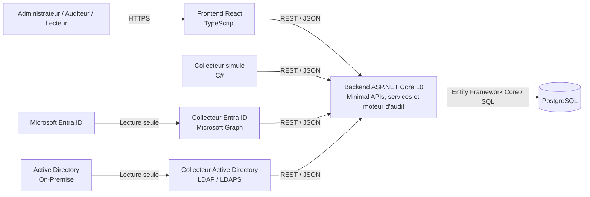
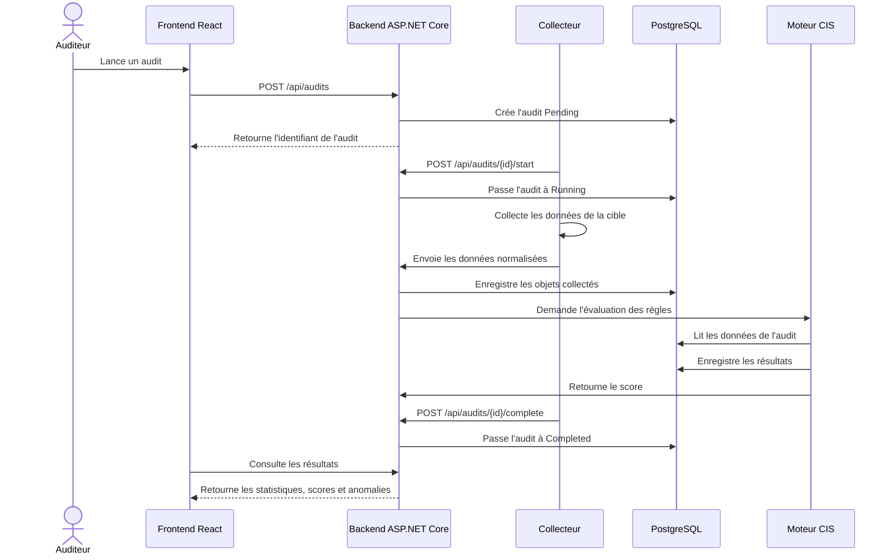
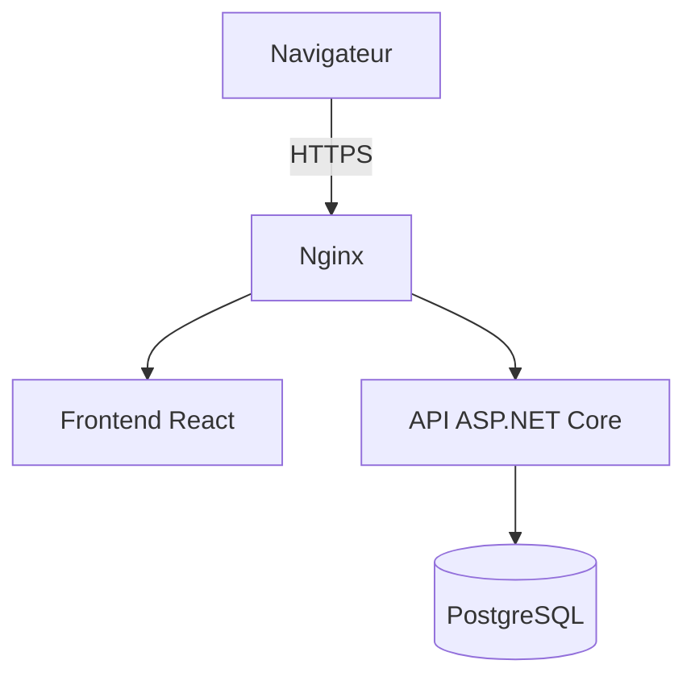

# Architecture technique

## 1. Objectif

L’application Identity Audit doit collecter, centraliser, analyser et présenter les informations liées aux identités et aux privilèges provenant de :

- Microsoft Entra ID ;
- Active Directory On-Premise.

L’architecture est organisée en composants séparés afin de faciliter le développement, les tests, la maintenance et l’ajout futur de nouveaux collecteurs.

Le projet vise notamment à :

- gérer les cibles à auditer ;
- déclencher et suivre les audits ;
- collecter les identités et les privilèges ;
- appliquer progressivement les règles liées aux CIS Controls 5 et 6 ;
- afficher les anomalies et les recommandations ;
- calculer un score de conformité ;
- conserver l’historique des audits.

## 2. Architecture générale



L’application adopte une architecture monolithique en couches, inspirée des principes de la Clean Architecture.

Les collecteurs récupèrent les données depuis les annuaires, puis les transmettent au backend. Le backend valide, normalise et enregistre ces données dans PostgreSQL. Le frontend communiquera uniquement avec le backend.

## 3. Composants

### 3.1 Frontend React

Le frontend constitue l’interface destinée aux administrateurs, aux auditeurs et aux lecteurs.

Responsabilités prévues :

- authentification des utilisateurs ;
- affichage du tableau de bord ;
- gestion des cibles ;
- lancement et suivi des audits ;
- affichage des identités collectées ;
- consultation des anomalies ;
- affichage des recommandations ;
- filtres et recherches ;
- export des résultats.

Le frontend ne communique pas directement avec PostgreSQL, Microsoft Entra ID ou Active Directory.

Il communique uniquement avec le backend au moyen de requêtes REST au format JSON.

### 3.2 Backend ASP.NET Core 10

Le backend constitue le composant central de l’application.

Il est développé avec ASP.NET Core 10 sous la forme d’une application monolithique organisée en couches.

Les responsabilités sont réparties entre quatre projets :

```text
IdentityAudit.Api
IdentityAudit.Application
IdentityAudit.Domain
IdentityAudit.Infrastructure
```

Le projet `IdentityAudit.Api` expose les routes HTTP au moyen des Minimal APIs d’ASP.NET Core.

Les endpoints sont regroupés par domaine fonctionnel :

```text
HealthEndpoints
TargetEndpoints
AuditEndpoints
IdentityEndpoints
DashboardEndpoints
```

Tous les groupes d’endpoints sont enregistrés dans l’application à travers la méthode :

```csharp
app.MapApiEndpoints();
```

Le flux général d’une requête est le suivant :

```text
Requête HTTP
     ↓
Minimal API
     ↓
Interface de service
     ↓
Implémentation du service
     ↓
Entity Framework Core ou requête SQL
     ↓
PostgreSQL
```

Exemple pour le tableau de bord :

```text
DashboardEndpoints
        ↓
IDashboardService
        ↓
DashboardService
        ↓
Fonction PostgreSQL
```

Le projet n’utilise pas MediatR.

Les endpoints appellent directement les interfaces de services grâce à l’injection de dépendances d’ASP.NET Core.

Cette décision permet de conserver une architecture simple, lisible et adaptée à la taille actuelle du projet.

Responsabilités principales du backend :

- exposer l’API REST ;
- valider les requêtes reçues ;
- gérer les cibles ;
- créer et suivre les audits ;
- recevoir les données des collecteurs ;
- normaliser les données reçues ;
- enregistrer les données dans PostgreSQL ;
- fournir les données du tableau de bord ;
- exécuter progressivement les règles CIS ;
- générer les anomalies et les recommandations ;
- calculer les scores de conformité ;
- conserver l’historique des audits ;
- préparer les futurs exports.

La validation des modèles est activée pour les Minimal APIs. Une requête invalide reçoit une réponse HTTP `400 Bad Request`.

Le backend expose également un document OpenAPI dans l’environnement de développement.

Le moteur d’audit CIS restera dans le backend. Les règles métier et les règles de conformité ne seront pas placées dans PostgreSQL.

### 3.3 PostgreSQL

PostgreSQL assure le stockage persistant des informations collectées et des résultats des audits.

Il contient ou contiendra notamment :

- les utilisateurs de l’application ;
- les cibles ;
- les audits ;
- les identités ;
- les groupes ;
- les appartenances aux groupes ;
- les rôles ;
- les attributions de rôles ;
- le catalogue des règles CIS ;
- les résultats des évaluations ;
- les anomalies ;
- les recommandations ;
- les journaux d’audit.

PostgreSQL ne se connecte jamais directement à Microsoft Entra ID ou à Active Directory.

Les accès à la base sont réalisés principalement avec Entity Framework Core et le fournisseur Npgsql.

La base contient également des objets destinés à préparer et à optimiser le futur tableau de bord :

```text
IX_Audits_TargetId_CreatedAt
vw_AuditDashboardSummary
fn_GetTargetDashboard(uuid)
```

L’index composite `IX_Audits_TargetId_CreatedAt` permet d’optimiser les recherches d’audits d’une cible, classés du plus récent au plus ancien.

La vue `vw_AuditDashboardSummary` centralise les principales statistiques de chaque audit.

Elle calcule notamment :

- le nombre total d’identités ;
- le nombre de comptes actifs ;
- le nombre de comptes désactivés ;
- le nombre de comptes privilégiés ;
- le nombre de comptes de service ;
- le nombre de comptes invités ;
- le nombre de comptes verrouillés.

La fonction `fn_GetTargetDashboard(uuid)` permet de récupérer les statistiques correspondant à une cible déterminée.

PostgreSQL participe ainsi à l’optimisation des lectures et des agrégations nécessaires au tableau de bord.

Les règles métier et les règles CIS restent toutefois exécutées dans le backend.

### 3.4 Collecteur simulé

Le collecteur simulé a été développé en C# afin de tester toute la chaîne fonctionnelle sans dépendre immédiatement d’un environnement Microsoft Entra ID ou Active Directory réel.

Responsabilités :

1. lire des identités fictives ;
2. créer un nouvel audit ;
3. démarrer l’audit ;
4. envoyer les identités au backend ;
5. terminer l’audit ;
6. vérifier que les données sont enregistrées dans PostgreSQL ;
7. mettre à jour la date de la dernière collecte de la cible.

Le collecteur simulé a permis de valider le cycle suivant :

```text
Pending
   ↓
Running
   ↓
Import des identités
   ↓
Completed
```

### 3.5 Collecteur Microsoft Entra ID

Le collecteur Entra ID utilisera Microsoft Graph.

Responsabilités prévues :

- s’authentifier auprès de Microsoft Entra ID ;
- récupérer les utilisateurs ;
- récupérer les invités ;
- récupérer les groupes ;
- récupérer les membres des groupes ;
- récupérer les rôles d’annuaire ;
- récupérer les attributions de rôles ;
- récupérer les informations d’activité accessibles ;
- récupérer les informations MFA accessibles ;
- convertir les résultats vers le modèle commun ;
- transmettre les données au backend.

Les permissions accordées devront être limitées aux droits de lecture strictement nécessaires.

### 3.6 Collecteur Active Directory

Le collecteur Active Directory sera exécuté sur Windows ou sur une machine pouvant joindre le domaine.

Il utilisera LDAP ou LDAPS.

Responsabilités prévues :

- tester la connexion au domaine ;
- récupérer les utilisateurs ;
- récupérer les groupes ;
- récupérer les appartenances aux groupes ;
- détecter les comptes désactivés ;
- détecter les comptes verrouillés ;
- récupérer la dernière connexion disponible ;
- identifier les groupes privilégiés ;
- identifier les comptes de service ;
- convertir les données vers le modèle commun ;
- transmettre les résultats au backend.

Le compte utilisé par le collecteur disposera uniquement de permissions de lecture.

## 4. Répartition entre le Mac et Windows

### 4.1 Mac M2

Le Mac est utilisé principalement pour développer :

- le backend ASP.NET Core ;
- la base PostgreSQL ;
- le frontend React ;
- le collecteur simulé ;
- le collecteur Entra ID ;
- le moteur de règles CIS ;
- les tests ;
- la documentation ;
- la gestion Git.

### 4.2 PC Windows

Le PC Windows sera utilisé principalement pour :

- préparer l’environnement Active Directory ;
- joindre ou accéder au domaine de test ;
- exécuter le collecteur Active Directory ;
- tester LDAP ou LDAPS ;
- tester les comptes et les groupes privilégiés ;
- envoyer les résultats au backend.

## 5. Communication entre les composants

Les échanges utilisent ou utiliseront :

```text
Protocole : HTTP en développement, puis HTTPS en déploiement
Style : API REST
Format : JSON
```

Exemples de communications :

```text
Frontend
    → Backend
    Création d’une cible ou lancement d’un audit

Collecteur
    → Backend
    Envoi des identités, groupes, rôles et relations

Backend
    → PostgreSQL
    Stockage des objets et des résultats

Frontend
    ← Backend
    Consultation des audits, scores et anomalies
```

Les collecteurs ne se connectent pas directement à PostgreSQL.

Ils transmettent leurs données au backend, qui contrôle les requêtes avant leur enregistrement.

## 6. Flux d’exécution d’un audit



La partie correspondant au moteur CIS sera ajoutée progressivement après la finalisation de la collecte et du stockage des données.

## 7. Modèle commun des collecteurs

Les collecteurs produiront les mêmes catégories de données :

```text
CollectionResult
├── Identities
├── Groups
├── GroupMemberships
├── Roles
├── RoleAssignments
├── Warnings
└── CollectedAt
```

Cette normalisation permettra au moteur CIS de fonctionner de la même manière quelle que soit la source.

Les champs qui ne sont pas disponibles dans une source seront enregistrés avec une valeur nulle ou inconnue.

La première version implémente actuellement la collecte des identités. Les autres catégories seront ajoutées progressivement.

## 8. Organisation du code

```text
identity-audit/
├── backend/
│   ├── IdentityAudit.Api
│   ├── IdentityAudit.Application
│   ├── IdentityAudit.Domain
│   └── IdentityAudit.Infrastructure
│
├── frontend/
│   └── identity-audit-ui
│
├── collectors/
│   ├── mock-collector
│   ├── entra-id
│   └── active-directory
│
├── database/
├── deployment/
├── tests/
├── docs/
└── README.md
```

### 8.1 IdentityAudit.Api

Le projet `IdentityAudit.Api` contient :

- les Minimal APIs ;
- les groupes d’endpoints REST ;
- l’enregistrement des services ;
- la configuration JSON ;
- la validation des requêtes ;
- la génération du document OpenAPI ;
- la gestion des réponses HTTP.

Les endpoints sont regroupés dans le dossier suivant :

```text
Endpoints/
├── ApiEndpoints.cs
├── HealthEndpoints.cs
├── TargetEndpoints.cs
├── AuditEndpoints.cs
├── IdentityEndpoints.cs
└── DashboardEndpoints.cs
```

Les anciens contrôleurs ASP.NET Core ont été remplacés par les Minimal APIs.

### 8.2 IdentityAudit.Application

Le projet `IdentityAudit.Application` contient :

- les interfaces de services ;
- les modèles d’entrée ;
- les modèles de sortie ;
- les DTO ;
- les résultats des opérations ;
- les contrats utilisés entre l’API et l’infrastructure.

Exemples :

```text
ITargetService
IAuditService
IIdentityService
IDashboardService
```

### 8.3 IdentityAudit.Domain

Le projet `IdentityAudit.Domain` contient :

- les entités métier ;
- les énumérations ;
- les relations entre les entités ;
- les concepts indépendants des technologies ;
- les futures règles métier.

Exemples d’entités actuellement présentes :

```text
Target
Audit
DirectoryIdentity
```

### 8.4 IdentityAudit.Infrastructure

Le projet `IdentityAudit.Infrastructure` contient :

- Entity Framework Core ;
- la configuration du `DbContext` ;
- le fournisseur PostgreSQL Npgsql ;
- les migrations ;
- les implémentations des services ;
- les requêtes SQL spécifiques ;
- les mécanismes techniques de persistance.

Exemples de services :

```text
TargetService
AuditService
IdentityService
DashboardService
```

## 9. Comparaison des approches ASP.NET Core

Deux approches principales ont été étudiées pour exposer les routes HTTP du backend : les contrôleurs MVC et les Minimal APIs.

Ces deux approches concernent la manière de construire l’API HTTP. Elles ne définissent pas, à elles seules, l’architecture générale de l’application.

### 9.1 API avec contrôleurs MVC

L’approche avec contrôleurs repose sur des classes héritant généralement de `ControllerBase`.

Exemple :

```csharp
[ApiController]
[Route("api/[controller]")]
public sealed class AuditsController : ControllerBase
{
}
```

Avantages :

- conventions MVC intégrées ;
- filtres d’action ;
- organisation connue dans les projets ASP.NET Core traditionnels ;
- adaptée aux contrôleurs volumineux ;
- adaptée aux applications utilisant de nombreuses fonctionnalités MVC.

Inconvénients pour le projet actuel :

- ajout de code répétitif ;
- multiplication des attributs ;
- organisation plus lourde pour des endpoints simples ;
- nécessité de conserver plusieurs classes de contrôleurs.

La première version du backend utilisait cette approche.

Les contrôleurs ont ensuite été remplacés par les Minimal APIs à la suite des recommandations de l’encadrant.

### 9.2 API avec Minimal APIs

Les Minimal APIs permettent de déclarer les routes et leurs traitements sans créer de classes héritant de `ControllerBase`.

Exemple :

```csharp
group.MapGet("/{id:guid}", GetByIdAsync)
    .WithName("GetAuditById");
```

Avantages :

- réduction du code répétitif ;
- injection directe des services ;
- regroupement clair des routes ;
- lecture rapide du fonctionnement d’un endpoint ;
- configuration plus légère ;
- bonne adaptation aux API REST modernes ;
- possibilité de limiter certains coûts liés au pipeline MVC ;
- configuration centralisée avec `MapApiEndpoints()`.

Le choix des Minimal APIs ne signifie pas que toutes les routes sont placées directement dans `Program.cs`.

Pour conserver une organisation claire, les endpoints ont été répartis dans plusieurs fichiers spécialisés :

```text
HealthEndpoints
TargetEndpoints
AuditEndpoints
IdentityEndpoints
DashboardEndpoints
```

La méthode `MapApiEndpoints()` centralise uniquement leur enregistrement.

### 9.3 Architecture retenue

L’architecture retenue est une architecture monolithique en couches, inspirée des principes de la Clean Architecture.

Elle repose sur :

- ASP.NET Core 10 ;
- les Minimal APIs ;
- l’injection de dépendances ;
- des interfaces de services dans la couche Application ;
- des implémentations dans la couche Infrastructure ;
- Entity Framework Core ;
- PostgreSQL.

Le découpage principal est le suivant :

```text
IdentityAudit.Api
        ↓
IdentityAudit.Application
        ↓
IdentityAudit.Domain

IdentityAudit.Infrastructure
        ↑
Implémente les interfaces définies
dans la couche Application
```

Le flux d’une requête est :

```text
Minimal API
    ↓
Interface de service
    ↓
Implémentation du service
    ↓
Entity Framework Core ou requête SQL
    ↓
PostgreSQL
```

Cette architecture offre un compromis entre :

- simplicité ;
- séparation des responsabilités ;
- lisibilité ;
- testabilité ;
- facilité de maintenance ;
- possibilité d’évolution.

### 9.4 Choix de ne pas utiliser MediatR

MediatR n’est pas une architecture ASP.NET Core.

Il s’agit d’une bibliothèque qui met en œuvre le patron de conception Mediator. Elle est souvent utilisée avec le modèle CQRS afin de séparer les commandes et les requêtes.

Avec MediatR, le flux pourrait devenir :

```text
Endpoint
   ↓
MediatR
   ↓
Commande ou requête
   ↓
Handler
   ↓
Persistance ou service technique
```

Cette approche peut être utile dans :

- les applications très complexes ;
- les systèmes comportant de nombreuses commandes et requêtes ;
- les architectures CQRS ;
- les applications nécessitant des pipelines applicatifs avancés ;
- les projets possédant de nombreux comportements transversaux.

Dans le projet Identity Audit, son utilisation aurait nécessité l’ajout de commandes, de requêtes et de handlers supplémentaires.

Pour la taille actuelle du projet, cette abstraction n’apporte pas de bénéfice suffisant.

Le projet n’utilise donc pas MediatR.

Les Minimal APIs appellent directement les interfaces de services par l’intermédiaire de l’injection de dépendances.

Le flux retenu reste ainsi simple :

```text
Minimal API
    ↓
Interface de service
    ↓
Implémentation du service
    ↓
PostgreSQL
```

## 10. Optimisation PostgreSQL du tableau de bord

Une optimisation spécifique de PostgreSQL a été réalisée afin de préparer le futur tableau de bord.

### 10.1 Analyse initiale

Les index présents avant l’optimisation étaient notamment :

```text
IX_Audits_TargetId
IX_Identities_AuditId
IX_Identities_AuditId_ExternalId
```

L’index unique suivant couvre déjà les recherches utilisant uniquement `AuditId`, car `AuditId` constitue sa première colonne :

```text
IX_Identities_AuditId_ExternalId
```

L’index simple `IX_Identities_AuditId` a donc été supprimé afin d’éviter un index redondant.

### 10.2 Index composite des audits

L’index simple sur `Audits(TargetId)` a été remplacé par :

```text
IX_Audits_TargetId_CreatedAt
```

Sa définition correspond à :

```sql
CREATE INDEX "IX_Audits_TargetId_CreatedAt"
ON public."Audits" ("TargetId", "CreatedAt" DESC);
```

Il répond aux requêtes du type :

```sql
SELECT *
FROM "Audits"
WHERE "TargetId" = p_target_id
ORDER BY "CreatedAt" DESC;
```

Il permet de filtrer les audits d’une cible et de les parcourir directement du plus récent au plus ancien.

### 10.3 Vue PostgreSQL

La vue suivante a été créée :

```text
vw_AuditDashboardSummary
```

Elle réalise les jointures entre :

```text
Targets
Audits
Identities
```

Elle calcule pour chaque audit :

- le nombre total d’identités ;
- le nombre de comptes actifs ;
- le nombre de comptes désactivés ;
- le nombre de comptes privilégiés ;
- le nombre de comptes de service ;
- le nombre de comptes invités ;
- le nombre de comptes verrouillés.

La vue simplifie les requêtes nécessaires au tableau de bord en centralisant les jointures et les agrégations.

Il s’agit d’une vue PostgreSQL normale. Elle ne stocke pas physiquement les résultats comme une vue matérialisée.

### 10.4 Fonction PostgreSQL

La fonction suivante a été créée :

```text
fn_GetTargetDashboard(uuid)
```

Elle prend l’identifiant d’une cible en paramètre et retourne les résultats de la vue correspondant à cette cible.

Les résultats sont classés selon :

```sql
ORDER BY "CreatedAt" DESC
```

Le flux PostgreSQL est le suivant :

```text
fn_GetTargetDashboard(uuid)
          ↓
vw_AuditDashboardSummary
          ↓
Targets + Audits + Identities
```

### 10.5 Service du dashboard

Le backend appelle la fonction PostgreSQL à travers :

```text
IDashboardService
DashboardService
```

Le service utilise une requête SQL paramétrée avec Entity Framework Core.

Le résultat PostgreSQL est converti en objets :

```text
DashboardAuditDto
```

Les compteurs issus de `COUNT()` sont représentés en C# avec le type `long`, correspondant au type PostgreSQL `bigint`.

### 10.6 Endpoint du dashboard

L’endpoint suivant a été ajouté :

```http
GET /api/dashboard/targets/{targetId}
```

Son comportement est le suivant :

```text
Cible existante avec audits
        → 200 OK avec les statistiques

Cible existante sans audit
        → 200 OK avec une liste vide

Cible inexistante
        → 404 Not Found
```

Le flux complet est :

```text
DashboardEndpoints
        ↓
IDashboardService
        ↓
DashboardService
        ↓
fn_GetTargetDashboard(uuid)
        ↓
vw_AuditDashboardSummary
        ↓
PostgreSQL
```

### 10.7 Analyse des performances

Les requêtes ont été analysées avec :

```sql
EXPLAIN (ANALYZE, BUFFERS)
```

La base de test contenait au moment de la mesure :

```text
2 cibles
6 audits
20 identités
```

Sur une table contenant seulement six audits, PostgreSQL a choisi une lecture séquentielle.

Ce choix est normal, car lire directement une très petite table peut être plus rapide que parcourir un index.

Le plan obtenu pour la recherche des audits indiquait notamment :

```text
Seq Scan on Audits
Execution Time: environ 0,564 ms
```

Afin de vérifier que l’index composite était correctement utilisable, la lecture séquentielle a été temporairement désactivée uniquement pendant un test.

PostgreSQL a alors utilisé :

```text
Index Scan using IX_Audits_TargetId_CreatedAt
```

avec un temps d’exécution d’environ :

```text
0,534 ms
```

Cette configuration n’a pas été conservée. PostgreSQL doit rester libre de choisir automatiquement le meilleur plan d’exécution.

L’analyse de la fonction complète du tableau de bord a également montré l’utilisation de :

```text
PK_Targets
IX_Identities_AuditId_ExternalId
```

Le temps d’exécution observé pour la fonction complète était d’environ :

```text
1,303 ms
```

Ces mesures sont réalisées sur une petite base de test. L’intérêt de l’index composite sera plus visible lorsque la base contiendra un grand nombre de cibles, d’audits et d’identités.

## 11. Principes de sécurité

L’architecture respecte ou devra respecter les principes suivants :

- accès en lecture seule aux annuaires ;
- aucun mot de passe ni secret dans Git ;
- secrets fournis par variables d’environnement ou par un mécanisme sécurisé ;
- validation des données envoyées à l’API ;
- contrôle futur des rôles de l’application ;
- limitation des permissions Microsoft Graph ;
- utilisation de LDAPS lorsque l’environnement le permet ;
- journalisation des opérations sensibles ;
- communications HTTPS lors du déploiement ;
- absence de correction automatique des comptes dans le MVP ;
- séparation entre la collecte, l’analyse et la présentation ;
- utilisation de requêtes SQL paramétrées ;
- limitation des informations sensibles enregistrées dans les journaux.

Les collecteurs disposeront uniquement des droits nécessaires à la lecture des données.

Le backend sera le seul composant applicatif autorisé à modifier les données dans PostgreSQL.

## 12. Déploiement prévu

Le déploiement principal sera réalisé sur Linux.



Ordre prévu :

1. installer PostgreSQL ;
2. créer la base de données et le compte applicatif ;
3. appliquer les migrations Entity Framework Core ;
4. publier le backend ASP.NET Core ;
5. construire le frontend React ;
6. configurer les variables d’environnement ;
7. créer un service `systemd` pour le backend ;
8. configurer éventuellement Nginx ;
9. activer HTTPS ;
10. tester l’ensemble de l’application.

Docker reste une amélioration optionnelle après la validation du MVP.

## 13. Première chaîne fonctionnelle réalisée

La première chaîne fonctionnelle a été validée avec le collecteur simulé.

Elle suit actuellement le flux suivant :

```text
Données fictives
        ↓
Collecteur simulé C#
        ↓
Minimal APIs ASP.NET Core
        ↓
Services applicatifs
        ↓
Entity Framework Core
        ↓
PostgreSQL
        ↓
Endpoint du tableau de bord
```

Les fonctionnalités validées comprennent :

- la gestion des cibles ;
- le test simulé de connexion à une cible ;
- la création d’un audit ;
- le passage d’un audit de `Pending` à `Running` ;
- l’importation des identités ;
- le passage de l’audit à `Completed` ;
- la mise à jour de la dernière collecte ;
- la consultation des identités d’un audit ;
- la consultation des statistiques du tableau de bord ;
- la gestion des erreurs `404 Not Found` ;
- la validation des requêtes incorrectes avec `400 Bad Request`.

Les principales routes actuellement disponibles sont :

```text
GET  /api/health

GET  /api/targets
GET  /api/targets/{id}
POST /api/targets
PUT  /api/targets/{id}
POST /api/targets/{id}/test-connection

GET  /api/audits
GET  /api/audits/{id}
POST /api/audits
POST /api/audits/{id}/start
POST /api/audits/{id}/complete

GET  /api/audits/{auditId}/identities
POST /api/audits/{auditId}/identities

GET  /api/dashboard/targets/{targetId}
```

La prochaine étape consistera à remplacer progressivement les données fictives par des données provenant de Microsoft Entra ID, puis d’Active Directory On-Premise.

Le moteur d’évaluation des règles liées aux CIS Controls 5 et 6 sera ensuite ajouté sur cette base fonctionnelle.
