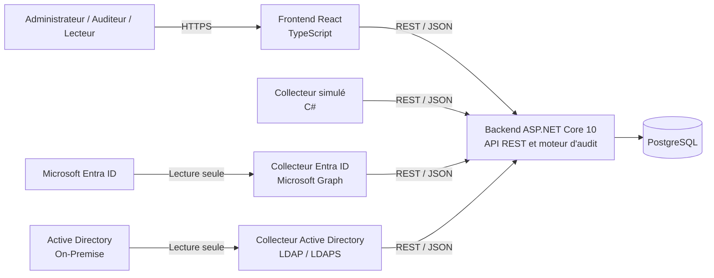
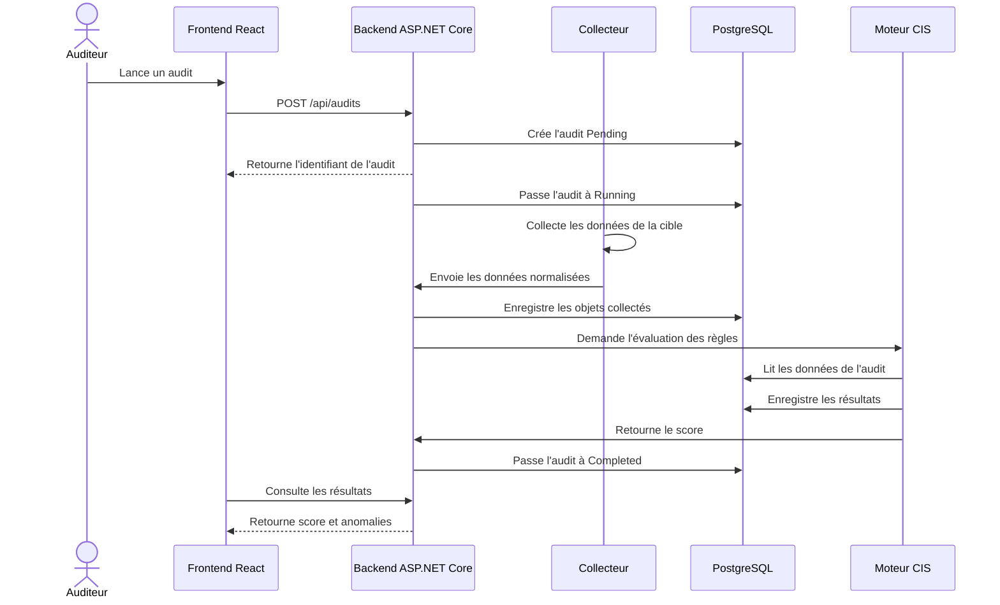
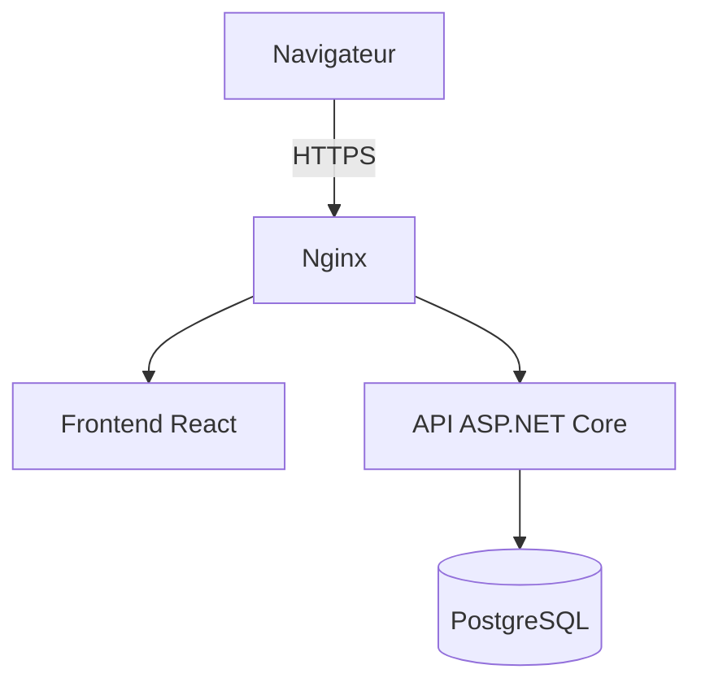

# Architecture technique

## 1. Objectif

L’application Identity Audit doit collecter, centraliser, analyser et présenter les informations liées aux identités et aux privilèges provenant de :

- Microsoft Entra ID ;
- Active Directory On-Premise.

L’architecture est organisée en composants séparés afin de faciliter le développement, les tests et l’ajout futur de nouveaux collecteurs.

## 2. Architecture générale



## 3. Composants

### 3.1 Frontend React

Le frontend constitue l’interface utilisée par les administrateurs, les auditeurs et les lecteurs.

Responsabilités :

- authentification des utilisateurs ;
- affichage du tableau de bord ;
- gestion des cibles ;
- lancement et suivi des audits ;
- affichage des identités collectées ;
- consultation des anomalies ;
- filtres et recherches ;
- export des résultats.

Le frontend ne communique pas directement avec PostgreSQL ni avec les annuaires.

Il communique uniquement avec le backend au moyen de requêtes REST au format JSON.

### 3.2 Backend ASP.NET Core 10

Le backend constitue le composant central de l’application.

Responsabilités :

- exposer l’API REST ;
- authentifier les utilisateurs ;
- appliquer les autorisations selon les rôles ;
- gérer les cibles ;
- créer et suivre les audits ;
- recevoir les données des collecteurs ;
- normaliser et valider les données reçues ;
- enregistrer les données dans PostgreSQL ;
- exécuter les règles CIS ;
- générer les résultats et les anomalies ;
- calculer le score de conformité ;
- conserver l’historique et les journaux ;
- préparer les exports.

Le moteur d’audit CIS fait partie du backend. Il ne sera pas placé dans PostgreSQL.

### 3.3 PostgreSQL

PostgreSQL assure uniquement le stockage persistant.

Il contient notamment :

- les utilisateurs de l’application ;
- les cibles ;
- les audits ;
- les identités ;
- les groupes ;
- les appartenances aux groupes ;
- les rôles ;
- les attributions de rôles ;
- le catalogue des règles ;
- les résultats des évaluations ;
- les journaux d’audit.

PostgreSQL ne se connecte jamais directement à Entra ID ou à Active Directory.

### 3.4 Collecteur simulé

Le collecteur simulé sera développé en premier.

Il permettra de tester toute la chaîne sans dépendre immédiatement d’un environnement réel.

Responsabilités :

1. lire des données fictives depuis des fichiers JSON ;
2. créer ou utiliser un audit ;
3. envoyer les identités, groupes et relations au backend ;
4. vérifier que les données sont enregistrées dans PostgreSQL.

### 3.5 Collecteur Microsoft Entra ID

Le collecteur Entra ID utilisera Microsoft Graph.

Responsabilités prévues :

- s’authentifier auprès de Microsoft Entra ID ;
- récupérer les utilisateurs ;
- récupérer les invités ;
- récupérer les groupes ;
- récupérer les membres des groupes ;
- récupérer les rôles d’annuaire ;
- récupérer les attributions de rôles ;
- récupérer les informations d’activité accessibles ;
- récupérer les informations MFA accessibles ;
- convertir les résultats vers le modèle commun ;
- transmettre les données au backend.

Les permissions accordées devront être limitées aux droits de lecture nécessaires.

### 3.6 Collecteur Active Directory

Le collecteur Active Directory sera exécuté sur Windows ou sur une machine pouvant joindre le domaine.

Il utilisera LDAP ou LDAPS.

Responsabilités prévues :

- tester la connexion au domaine ;
- récupérer les utilisateurs ;
- récupérer les groupes ;
- récupérer les appartenances ;
- détecter les comptes désactivés ;
- détecter les comptes verrouillés ;
- récupérer la dernière connexion disponible ;
- identifier les groupes privilégiés ;
- identifier les comptes de service ;
- convertir les données vers le modèle commun ;
- transmettre les résultats au backend.

Le compte utilisé par le collecteur disposera uniquement de permissions de lecture.

## 4. Répartition entre le Mac et Windows

### Mac M2

Le Mac sera utilisé pour développer principalement :

- le backend ASP.NET Core ;
- PostgreSQL ;
- le frontend React ;
- le collecteur simulé ;
- le collecteur Entra ID ;
- le moteur de règles CIS ;
- les tests ;
- la documentation ;
- la gestion Git.

### PC Windows

Le PC Windows sera utilisé principalement pour :

- préparer l’environnement Active Directory ;
- joindre ou accéder au domaine de test ;
- exécuter le collecteur Active Directory ;
- tester LDAP ou LDAPS ;
- tester les comptes et groupes privilégiés ;
- envoyer les résultats au backend.

## 5. Communication entre les composants

Les échanges utiliseront :

```text
Protocole : HTTP puis HTTPS
Style : API REST
Format : JSON
```

Exemples de communications :

```text
Frontend
    → Backend
    Création d’une cible ou lancement d’un audit

Collecteur
    → Backend
    Envoi des identités, groupes, rôles et relations

Backend
    → PostgreSQL
    Stockage des objets et des résultats

Frontend
    ← Backend
    Consultation des audits, scores et anomalies
```

## 6. Flux d’exécution d’un audit



## 7. Modèle commun des collecteurs

Les collecteurs produiront les mêmes catégories de données :

```text
CollectionResult
├── Identities
├── Groups
├── GroupMemberships
├── Roles
├── RoleAssignments
├── Warnings
└── CollectedAt
```

Cette normalisation permet au moteur CIS de fonctionner de la même manière quelle que soit la source.

Les champs qui ne sont pas disponibles dans une source seront enregistrés avec une valeur nulle ou inconnue.

## 8. Organisation du code

```text
identity-audit/
├── backend/
│   ├── IdentityAudit.Api
│   ├── IdentityAudit.Application
│   ├── IdentityAudit.Domain
│   └── IdentityAudit.Infrastructure
│
├── frontend/
│   └── identity-audit-ui
│
├── collectors/
│   ├── mock-collector
│   ├── entra-id
│   └── active-directory
│
├── database/
├── deployment/
├── tests/
├── docs/
└── README.md
```

### IdentityAudit.Api

Contiendra :

- les contrôleurs ;
- les endpoints REST ;
- la configuration de l’application ;
- l’authentification ;
- la gestion des réponses HTTP.

### IdentityAudit.Application

Contiendra :

- les services applicatifs ;
- les cas d’utilisation ;
- les interfaces ;
- les modèles d’entrée et de sortie ;
- l’orchestration des audits.

### IdentityAudit.Domain

Contiendra :

- les entités métier ;
- les énumérations ;
- les règles métier ;
- les résultats d’évaluation ;
- les concepts indépendants des technologies.

### IdentityAudit.Infrastructure

Contiendra :

- Entity Framework Core ;
- PostgreSQL ;
- les implémentations des repositories ;
- la journalisation ;
- les communications avec les services externes ;
- les mécanismes techniques de persistance.

## 9. Principes de sécurité

L’architecture respectera les principes suivants :

- accès en lecture seule aux annuaires ;
- aucun mot de passe ni secret dans Git ;
- secrets fournis par variables d’environnement ou mécanisme sécurisé ;
- validation des données envoyées à l’API ;
- contrôle des rôles de l’application ;
- limitation des permissions Microsoft Graph ;
- utilisation de LDAPS lorsque l’environnement le permet ;
- journalisation des opérations sensibles ;
- communications HTTPS lors du déploiement ;
- absence de correction automatique des comptes dans le MVP.

## 10. Déploiement prévu

Le déploiement principal sera réalisé sur Linux.



Ordre prévu :

1. installer PostgreSQL ;
2. publier le backend ASP.NET Core ;
3. construire le frontend React ;
4. configurer les variables d’environnement ;
5. créer un service systemd pour le backend ;
6. configurer éventuellement Nginx ;
7. activer HTTPS ;
8. tester l’application.

Docker reste une amélioration optionnelle après validation du MVP.

## 11. Première chaîne fonctionnelle à réaliser

La première version ne contiendra pas encore les deux collecteurs réels.

Elle suivra cette chaîne minimale :

```text
Fichier JSON fictif
        ↓
Collecteur simulé C#
        ↓
API ASP.NET Core
        ↓
PostgreSQL
        ↓
Moteur de règles
        ↓
Résultats de l’audit
```

Une fois cette chaîne validée, le fichier JSON sera progressivement remplacé par les données provenant d’Entra ID puis d’Active Directory.
